<!--
  %\VignetteEngine{knitr::rmarkdown}
  %\VignetteIndexEntry{microbiome tutorial}
  %\usepackage[utf8]{inputenc}
-->
Printing in a Periphery: a Quantitative Study of Finnish Knowledge Production, 1640-1828
========================================================================================

TILANNE (6.7.2016):

Paperin kommentointi ja kehittäminen siirretty slide-rmd:n. JANI, kommentoi siis sitä pdf:ää mikä generoitu sen pohjalta. Myös TODOt täältä siirretty sinne.

UUSIA TODOJA (5.7.2016):

**Voitko katsoa että OK ja poistaa sitten tästä mitkä oli jo hoidettu tyydyttävästi ?**

**PUBLISHER-TODO2(lisää)**

**BOOKINFINLAND-TODO(lisää)**

**BOOKINFINLAND-5.1**

**KIELI%-TODO**

**50PAGES-TODO**

**BOOKFORMATS-TODO**

**KUNGLIGAPUB-TODO1 (mietitään onnistuuko yhden Kungligan asiasanalistauksen avulla)**

**KUNGLIGAPUB-TODO2**

**KUNGLIGAPUB-TODO3**

**KUNGLIGAPUB-TODO4**

**AUTHOR-TODO1**

**AUTHOR-TODO2**

**TODO\_Publisher analysis\_ JANI: Täsmennetty alle.**

Tämä lista kiireysjärjestyksessä. Ensimmäiset 6 listalla pitäisi olla kohtuu nopea toteuttaa, ensimmäiset 2 (\*\*PUBLISHER-TODO2(lisää) + BOOKINFINLAND-TODO(lisää)) ovat rajauskysymyksiä ja seuraavat (BOOKINFINLAND-5.1 + KIELI%-TODO + 50PAGES-TODO + BOOKFORMATS-TODO) ovat täydentäviä kuvia.

KUNGLIGAPUB1&2 on kaksi vaiheinen ja vaatii vähän enemmän työtä, mutta tärkeä.

AUTHOR-osio toteutetaan nyt jos ehditään. Pikkuhiljaa aletaan miettiä myös mikä karttamuotoinen kuva tuoteutetaan ja aletaan sitten hioa tätä samalla kohti esitystä.

**Lisäksi seuraavat TODOt kesken. Duplikaatti-kuvan toteuttaminen taas päätetään kun saadaan muut tehtyä. Jotain sillä kannattaa joka tapauksessa tehdä:**

**TODO: Hege's deduplication code for specific figures. Particular figures to be decided.**

Introduction
------------

Matti Klinge HYn historia; Jari Niemelä, Vain hyödynkö tähden (väitöskirja) käsittelee Turun yliopiston asemaa.

Östholm, Hanna, Litteraturens uppodling : läsesällskap och litteraturkritik som politisk strategi vid sekelskiftet 1800; vertailee Turkua ja Uppsalaa lukuseurojen kautta.

Grönroos, Henrik & Nyman, Ann-Charlotte, Boken i Finland, 1996.

Suomen taloushistoria, Historiallinen tilasto 3, 1983.

Vasenius, Valfrid, Suomalainen kirjallisuus, 1544-1877, 1878.

Gardberg, Carl-Rudolf, Kirjapainotaito Suomessa I-III, 1949-1973.

Heininen, Simo, Ulkomaisen kirjallisuuden tulo Suomeen 1531-1600. SKHSV, 1991.

Häkli, Esko, Näin syntyi ja säilyi suomalainen kirja, 1989.

Laine, Tuija, Vanhimman suomalaisen kirjallisuuden käsikirja, 1997.

Vieraskielinen kirjallisuus Suomessa Ruotsin vallan aikana.

Wittman, Reinhard, Was there a reading revolution at the end of the eighteenth century? A history of reading in the west. Cambridge, 2003.

Aatehistoria ja digitaalisten aineistojen mahdollisuudet (Tolonen and Lahti, 2015)

We have prepared open data analytical ecosystem for in-depth analysis of such data collections (Lahti, Ilomäki, and Tolonen, 2015).

You can cite with the DOI (the citation info will then be collected automatically): (Lahti, Ilomäki, and Tolonen, 2015) or alternatively add new references to the [bib file](bibliography.bib) and then cite using the key with (Lahti, Ilomäki, and Tolonen, 2015). Such citations will be automatically numbered and collected in references section.

-   Knowledge production has been approached largely through a national perspective, here we shift focus by combining materials from Sweden and Finland and by specifically looking at cities as sites for knowledge production. Cities are to this effect seen as partly supplementing, partly competing intellectual centres.

Results
-------

LL: yes we can rather easily add map visualization when it is clear what we like to present using maps. For instance the code we used for LIBER to visualize differences in publishing activity across UK can be reused (with different regions), also videos can be made for presentation if we like. But I would first focus on findings, and polish the visualizations later. I will try to look at maps somewhere this week. The less there are other todo points, the more there will be time for maps. If you like to see some result specifically on a map, please mark it so and I can check.

Let us look at top publication places during the period 1650-1750 in Fennica:


The following figure highlights publisher title count changes around 1700 drop in Turku, the most significant publishing place at the time:


Here the same for the complete Fennica:

    ## Warning: Unknown column 'PANEL'


Paper per title count ratio per publisher. \[nähdään voidaanko sanoa onko joku selkeästi asetusten julkaisija ja toisella myös kirjoja (tai asetuskokoelmia).\]


### General trends: Fennica vs. Kungliga

-   [Fennica overview](https://github.com/rOpenGov/fennica/blob/master/inst/examples/overview.md)
-   [Kungliga overview](https://github.com/rOpenGov/kungliga/blob/master/antagomir/overview.md)

Top-author timelines. Putsaus ok (näistä tsekattu, että ei löydy ainakaan isoa määrää laskuista puuttuvia nimivariantilla julkaistuja teoksia). Kungligassa väitöskirjat näyttelevät huomattavasti pienempää osaa kuin Fennicassa. Näkyy näistä top-auktori kuvista.

**AUTHOR-TODO1 Fennica top-auktoreiden julkaisijat: Kuka julkaisee top-auktoreita, milloin ja kuinka paljon? Toimenpiteet: valitse tarkastelun kohteeksi Fennicasta top-20 auktoreiden kaikki teokset (yhteinen aineisto, ei erotteluja sen sisällä mihinkään suuntaan). Tarkastele tämän aineiston julkaisijoita aikajanalla (eli samansuuntainen analyysi kuin BOOKINFINLAND-DONE3 with top-publishers). Esim. 4 top-julkaisijaa tälle aineistolle + muut kategoria. Yksi kuva, 5 viivaa aikajanalla, jos toimii käytännössä. Jos ei, niin voi tehdä useamman kuvan.**

**AUTHOR-TODO2 Kungliga top-auktoreiden julkaisijat: sama kuin edellä, mutta nyt Kungliga top-20-auktoreiden teosten julkaiseminen ajakajanalla tarkastelun kohteena eli kuka julkaisee top-auktoreita, milloin ja kuinka paljon.**


Fennica yhteenvedoissa on EDITIONS kohta. Kuvia mahdollista saada? On nimittäin mielenkiintoinen kysymys. LL: ok lisasin tan sinne - voin elaboroida lisaa jos on ehdotuksia:

MT: otetaan tarkasteluun ainoastaan sellaiset julkaisut joista on enemmän kuin yksi editio. Eli editioita pitää olla kaksi tai useampi, että lasketaan mukaan. Näistä sitten tarkastellaan ainoastaan sen ensimmäisen edition ilmestymistä. Lisäksi voisi piirtää toisen kuvan jossa tarkastellaan muita kuin sen ensimmäisen edition ilmestymistä (eli toinen, kolmas jne. editiot). LL: tää lienee TODO-listan häntäpäässä? Tuntuu vähemmän tärkeältä kuin muut eli skippaan for now. OK


Overall development in publishing activity:


The top publication places ranked by the title count


Comparison of printing activity in Turku, Uppsala, Lund, and Stockholm. Turussa julkaiseminen alkaa vasta 1640-luvulla, mutta ollaan kiinnostuttu ruotsalaisesta julkaisemisesta ennen sitä. Esim miten Turun yliopiston perustaminen vaikuttaa ruotsalaiseen julkaisukenttään 1600-luvun aikana.


### Effects of historical events

**Riksdagar** are in some cases associated with publishing peaks (see Figure ...). See "Vapauden ajan valtiopäivät" from 1719 onwards ?

In particular: Riksdag Stockholm 20 januari 1719 1 juni 1719; Stockholm 14 maj 1734 14 december 1734; Stockholm 21 februari 1765 21 oktober 1766; Norrköping & Stockholm 22 april 1769 5 februari 1770; Stockholm 19 juni 1771 12 september 1772; Gävle 26 januari 1792 24 februari 1792.

The publishing of historical works in .. on a timeline highlighting the eras of the riksdagar (16..-16..)..

**Painovapaus**, 1766, räjähtääkö / kasvaako julkaiseminen merkittävästi ja miten tämä näkyy Tukholma vs. muu valtakunta (ml. Turku)? Painovapaus on 1766-1772, miten tämä näkyy ?


Focus on Gävle (gray) during riksdagar. Gävle has 0 occurrences in Fennica, hence not included here. The figure on Gävle is based on Kungliga.


**Political events** Kaaviot Tukholmasta, Uppsalasta, Lundista, Greifswaldista ja Turusta ajalle 1760-1780, joissa näkyy vuosittain julkaisumäärät, arvio paperinkulutuksesta ja kustantajien määrästä. Nämä pitää tehdä erikseen Fennicasta ja Kungligasta. Tärkeää, että saadaan jokaisesta vuodesta oma piste/luku. Trendiviiva ei ole kovinkaan kiinnostava, koska tässä yritetään selvittää sitä millä tavalla painovapausaika (1766-1774) erottuu materiaalissa. Yksi aikaisemman tutkimuksen väitteistä on se, että pamflettikirjoittelu räjähtää tänä aikana. Tätä testataan vertaamalla paperinkulutusta ja nimikkeiden määrää. Julkaisijoiden määrän kasvu näkyy Kungligan materiaalissa Tukholman osalta ja Turunkin osalta päästään kymmeneen julkaisijaan joten verrataan tätä muihin kaupunkeihin. Synnyttääkö painovapaus uusia julkaisijoita (vastaus on kyllä)?


Title counts in selected places in the Kungliga catalogue.


Kungliga publications outside Sweden and Finland.


### Book printing in Finland


Analyysi voi tapahtua aikajanalla, mutta voisi myös ajatella suhteellista kehitystä tässä jollain muulla esitystavalla, olisiko se sitten jonkinlainen prosenttianalyysi? Tämä analyysi kannattaa jatkaa myös pidemmälle kuin 1828 Fennican osalta.

 ranska ja venäjä pitäisi nostaa omiksi ryhmikseen tähän prosenttianalyysiin! **OK DONE**

**KIELI%-TODO sama prosenttianalyysi kielistä mutta paikkakuntakohtaisesti (sekä Fennican että Kungligan mukaan): Turku, Greifswald, Stockholm, Uppsala, Lund. Rajataan analyysi vuoteen 1828.**


**Publishing in Finland kieliolosuhteet muualla 1**: Greifswaldin kieliprofiili vuoteen 1828 asti (käytännössä 1815) Kungligan osalta. Onko Greifswaldissa samanlainen kielimonimuotoisuus läsnä kuin Turussa? **OK en ollu varma mita tarkotit kieliprofiililla mut plottasin nyt uniikkien kielten maaran mainituille paikoille 1640-1828. Nopeasti voin tehda muutakin jos tasmennatte. Hitaammin voin tehda viela enemman jos alan itse tutkia aineistoa huolellisesti mutta sit jaa muut jutut eli skippaan for now.**

JM: Tämän voi poistaa, myös kaavion. Yllä on sama juttu, mutta järkevämmin formuloitu. Pahoittelut sekvaasta muotoilusta ja turhan työn teettämisestä.


### BOOKINFINLAND-DONE2

Fennica, Hartaus- yms. kirjallisuuden kieli (suomi vai ruotsi) milloin alkaa yleistyä suomenkielinen ja miten tämän julkaiseminen suomeksi kasvaa? Toteutus, valitaan kaikki teokset joihin liittyy joku seuraavista asiasanoista: virret;arkkiveisut;hartauskirjat;katekismukset;rukouspäivät;saarnat;aapiset;rukoukset;rukous;hengelliset laulut;hartauspuheet;virsikirjat. Tämän jälkeen tarkkaillaan aikajanalla näiden teosten esiintymistä, erottavana tekijänä kieli (samat 5 kategoriaa kuin edellisessä analyysissä).

TODO (to be decided): Kungligan subject topiceista voisi tuottaa vastaavat niputettavat asiasanaryhmät Kungligalle (Jani ja Mikko): <https://github.com/rOpenGov/kungliga/blob/master/output.tables/subject_topic_accepted.csv> Näistä sitten oma analyysi joka suhtautuu Fennicaan. LL: voin tehda jos saan selvan listan asiasanoista.

General analysis with all documents combined:


Same with selected publication places:


Same with top publishers

### BOOKINFINLAND-DONE3

Sama kuin edellä, mutta asiasanat tässä: hautajaiset;häät;juhlamenot.

General analysis with all documents combined:


Same with selected publication places:


Same with top publishers

### BOOK IN FINLAND 4

Edellisten yhdistäminen. Samat analyysit, mutta asiasanoina kaikki aiemmista kohdista yhdistettynä: virret;arkkiveisut;hartauskirjat;katekismukset;rukouspäivät;saarnat;aapiset;rukoukset;rukous;hengelliset laulut;hartauspuheet;virsikirjat;hautajaiset;häät;juhlamenot

Hartauskirjallisuudesta ks. Osmo Tiililä, Rukoilevaisten kirjoja, 1961.

General analysis with all documents combined:


Same with selected publication places:


Same with top publishers

### BOOK IN FINLAND

Kielikohtainen vertailu myös lääketieteen osalta. Ajatuksena tässä on, että hartauskirjallisuutta on hyvä verrata tiedejulkaisemiseen. 1800-luvun jukisuuteen kuuluu vahvasti tarina kansallisista tieteista (historia, suomen kieli, folkloristiikka jne), ja niissä suomenkielen nusu on aika hyvin selvitetty juttu. Sama koskee tiedejulkaisemista, mutta siinä argumentit olivat erilaiset. Tästä on Katja Huumon väitöskirja ”Perkeleen kieli”, jossa käydään laadullisen tutkimuksen kautta tieteen kielikiistoja 1800-luvulla. Ajattelen, että lääketieteen osalta asiasanat ovat ehkä kaikkein luotettavimmat, joten voisi tarkastella lääketiedettä ja verrata siihen hartauskirjallisuuteen. Hartauskirjallisuuden osaltahan pyrkimys suomeksi julkaisemiseen oli kovin vahva koska se tieto oli kansalle tärkeää. Lääketieteellinenkin tieto kansallistettiin, mutta myöhemmin.

Eli: Fennicasta kaikki kirjallisuus, jossa asiasana lääketiede (muut lääkeaiheiset eivät välttämättä kuulu tähän, noita on muuten kummallisen vähän). Tätä pitää jatkaa mielellään vuoteen 1900 asti, tai ainakin yhtää pitkälle kuin hartauskirjojakin.

Title count for different places. Fennica, no time limit.

    ## 
    ##       Jena      Pärnu  Stockholm Wittenberg  Göttingen Greifswald 
    ##          1          1          1          1          2          2 
    ##     Leiden       Lund      Tartu    Uppsala      Turku 
    ##          2          2          7         40        104

General analysis with all documents combined:


Kaupungittain vertailu on kiinnostavaa, koska tuntuma on, että Turun ja Helsingin osalta ei latinan, ranskan ja saksankielista matskua pitäisi löytyä. Silloin vernakularisointi tapahtuu erityisesti muualla. HUOM: Helsingissä ei ole painettu mitään asiasanalla lääketiede.

Huumo, Katja. "Perkeleen kieli" : suomen kieli ja poliittisesti korrekti tiede 1800-luvulla, Helsinki : Suomen tiedeseura, 2005.


**Publishing in Finland** Kaaviot Fennicasta, jossa lasketaan eri kielten mukaan asiasanojen määrä eri vuosina. Asiasanat ovat osin arbriträärisiä, mutta ehkä niiden määrän pohjalta voidaan sanoa jotain siitä millä kielellä on julkaistu mitäkin. Minusta voisi tehdä kaavion vuoteen 1828 sekä toisen vuoteen 1900. Tiedän että 1800-luvun osalta Fennicassa on kielellinen bias, mutta esim. suomenkielen tarkastelun kannalta tällä ei ole merkitystä, sillä kaikki suomenkielinen materiaali on tarkkaan läpikäytyä. Tässä näky toivottasti se millä tavalla 1855 jälkeen suomenkielinen julkaiseminen laajeni. Kaavio joka näyttää asiasanat vuoteen 1828 auttaa toivottavasti asettamaan 1700-luvun suomenkielisen hartauskirjallisuuden kontekstiinsa. **OK tässä - onko se mitä haluttiin?**


### BOOKINFINLAND 5

Kielten viilaus, ranska ja venäjä omiksi kategorioikseen mukaan **DONE**

Samat analyysit kuin yllä, seuraavat asiasanaryppäät. Tarkoituksena analysoida yliopisto-opetuksen muutosta. Kokonaismäärät ja kielikohtaiset vaihtelut kiinnostavat.

1.  kirkkohistoria;raamatunhistoria;eksegetiikka;homiletiikka;dogmatiikka;teologia

2.  oppihistoria;antiikki;historia

3.  filosofia;luonnonfilosofia;metafysiikka;logiikka

4.  luonnontieteet;matematiikka;fysiikka;kemia;tähtitiede;maantiede;geodesia;geofysiikka;meteorologia

5.  retoriikka;poetiikka;kielitiede;kielioppi

6.  heprean kieli;kreikan kieli;latinan kieli

7.  psykologia;yhteiskuntafilosofia;valtiofilosofia;talous;raha;moraali;velvollisuudet;kasvatus;maanviljely;maatalous;kalastus

8.  luonnonhistoria;lääketiede;tartuntataudit;eläintiede;kasvitiede;kasvisto;eläimet;eläinsuojelu;eläimistö;eläintaudit;hevonen

9.  naiset;naisen asema;naisasialiikkeet;naisasiajärjestöt

10. etsintäkuulutukset;rikokset;oikeus;rangaistukset

Näissä kiinnostaa myös julkaisijakohtaiset vaihtelut (tai oikeastaan kaikki kuvat joita esim. BOOKINFINLAND-4:ssa. Tämä vain jatkaa siitä mihin tuo edellinen jää. **OK now?**

    ## [1] "kirkkohistoria;raamatunhistoria;eksegetiikka;homiletiikka;dogmatiikka;teologia"

    ## [1] "kirkkohistoria;raamatunhistoria;eksegetiikka;homiletiikka;dogmatiikka;teologia"

    ## [1] "oppihistoria;antiikki;historia"

    ## [1] "oppihistoria;antiikki;historia"

    ## [1] "filosofia;luonnonfilosofia;metafysiikka;logiikka"

    ## [1] "filosofia;luonnonfilosofia;metafysiikka;logiikka"

    ## [1] "luonnontieteet;matematiikka;fysiikka;kemia;tähtitiede;maantiede;geodesia;geofysiikka;meteorologia"

    ## [1] "luonnontieteet;matematiikka;fysiikka;kemia;tähtitiede;maantiede;geodesia;geofysiikka;meteorologia"

    ## [1] "retoriikka;poetiikka;kielitiede;kielioppi"

    ## [1] "retoriikka;poetiikka;kielitiede;kielioppi"

    ## [1] "heprean kieli;kreikan kieli;latinan kieli"

    ## [1] "heprean kieli;kreikan kieli;latinan kieli"

    ## [1] "psykologia;yhteiskuntafilosofia;valtiofilosofia;talous;raha;moraali;velvollisuudet;kasvatus;maanviljely;maatalous;kalastus"

    ## [1] "psykologia;yhteiskuntafilosofia;valtiofilosofia;talous;raha;moraali;velvollisuudet;kasvatus;maanviljely;maatalous;kalastus"

    ## [1] "luonnonhistoria;lääketiede;tartuntataudit;eläintiede;kasvitiede;kasvisto;eläimet;eläinsuojelu;eläimistö;eläintaudit;hevonen"

    ## [1] "luonnonhistoria;lääketiede;tartuntataudit;eläintiede;kasvitiede;kasvisto;eläimet;eläinsuojelu;eläimistö;eläintaudit;hevonen"

    ## [1] "naiset;naisen asema;naisasialiikkeet;naisasiajärjestöt"

    ## [1] "naiset;naisen asema;naisasialiikkeet;naisasiajärjestöt"

    ## [1] "etsintäkuulutukset;rikokset;oikeus;rangaistukset"

    ## [1] "etsintäkuulutukset;rikokset;oikeus;rangaistukset"


**BOOKINFINLAND-5.1** Jatketaan tätä analyysia julkaisijatarkasteluun. Tehdään näiden valmiiden kuvien pohjalta vielä toinen setti kuvia joissa kaikki kielet yhdistetään kuvakohtaisesti (vain yksi viiva, tarkasteltavat asiasanaryhmät kuvakohtaisesti samat) ja piirretään Fennican top-5 julkaisijoiden perusteella kuvat miten he julkaisevat näitä mainittuja sanaryppäitä (vai julkaisevatko ollenkaan). Lisäksi kategoria muut julkaisijat pitää piirtää myös koska akateeminen kirjapaino on tässä kategoriassa. **OK now ? Eli samat kuvat mutta nyt eroteltu julkaisijan mukaan?**

    ## [1] "kirkkohistoria;raamatunhistoria;eksegetiikka;homiletiikka;dogmatiikka;teologia"

    ## [1] "kirkkohistoria;raamatunhistoria;eksegetiikka;homiletiikka;dogmatiikka;teologia"

    ## [1] "oppihistoria;antiikki;historia"

    ## [1] "oppihistoria;antiikki;historia"

    ## [1] "filosofia;luonnonfilosofia;metafysiikka;logiikka"

    ## [1] "filosofia;luonnonfilosofia;metafysiikka;logiikka"

    ## [1] "luonnontieteet;matematiikka;fysiikka;kemia;tähtitiede;maantiede;geodesia;geofysiikka;meteorologia"

    ## [1] "luonnontieteet;matematiikka;fysiikka;kemia;tähtitiede;maantiede;geodesia;geofysiikka;meteorologia"

    ## [1] "retoriikka;poetiikka;kielitiede;kielioppi"

    ## [1] "retoriikka;poetiikka;kielitiede;kielioppi"

    ## [1] "heprean kieli;kreikan kieli;latinan kieli"

    ## [1] "heprean kieli;kreikan kieli;latinan kieli"

    ## [1] "psykologia;yhteiskuntafilosofia;valtiofilosofia;talous;raha;moraali;velvollisuudet;kasvatus;maanviljely;maatalous;kalastus"

    ## [1] "psykologia;yhteiskuntafilosofia;valtiofilosofia;talous;raha;moraali;velvollisuudet;kasvatus;maanviljely;maatalous;kalastus"

    ## [1] "luonnonhistoria;lääketiede;tartuntataudit;eläintiede;kasvitiede;kasvisto;eläimet;eläinsuojelu;eläimistö;eläintaudit;hevonen"

    ## [1] "luonnonhistoria;lääketiede;tartuntataudit;eläintiede;kasvitiede;kasvisto;eläimet;eläinsuojelu;eläimistö;eläintaudit;hevonen"

    ## [1] "naiset;naisen asema;naisasialiikkeet;naisasiajärjestöt"

    ## [1] "naiset;naisen asema;naisasialiikkeet;naisasiajärjestöt"

    ## [1] "etsintäkuulutukset;rikokset;oikeus;rangaistukset"

    ## [1] "etsintäkuulutukset;rikokset;oikeus;rangaistukset"


These are intriguing graphs. Potentially they reveal the story of the development of the Academy in Turku in an elegant manner. All disciplines suffer a dramatic decline after 1700, which is due to external causes (war, famine etc.). Philosophy (including logic and rhetoric) do not bounce back once the situation is normalised towards the middle of the eighteenth century. Having been somewhat thriving in 17th-century, philosophy is close to extinction as an academic subject by the second half of eighteenth century. It seems that natural science (and related fields) take over, especially when extended topic of medicine is included here. What is interesting about natural science is that the printing happens in several different languages (note also that the topics included in this category are perhaps more wide-ranging, which might play a part). Economy (and related fields) is a tremendous case in point that should be contrasted with religious/devotional literature towards the second half of eighteenth century. The reason for this is that Swedish is the predominant language (whereas the devotional literature is mainly in Finnish). Hebrew-Latin-Greek seem to do better than philosophy. Thus, perhaps there is a point in that book: Vain hyödynkö tähden?. Latin publishing of theology (and related fields) goes down as well. History does suprisingly well throughout the period.

### Book as media: development over time

Paper consumption per document in the top publication places. Note that paper consumption estimates have still problems so take this with reservations. Are there time periods with remarkable changes in paper consumption per document (meaning that small or large volumes suddenly become more frequent) ?


Overview on how over 50 page documents spread in time. Paper consumption in books (over 50 pages; balls) versus other documents (less or equal than 50 pages; triangles).


**Local focus** Tarkastelun kohteeksi yliopistokaupungit: Turku, Tukholma, Lund, Greifswald, Uppsala, Tartu, Vyborg, Helsinki. Figure is omitted if there is no data.


Average paper consumption per document over time:


The development of book formats over time. Folios (1to ja 2to) are largely missing (in contrast to ESTC). Moreover, the quarto (4to) and octavo (8vo) increase rapidly in 1700s.


Paper consumption for different document formats over time. Each point represents a decade. Loess smoothing.


**Local focus** Tarkasteluun Kungligasta yksittäiset yliopistokaupungit: Turku, Tukholma, Lund, Greifswald, Uppsala, Tartu, Vyborg, Helsinki. Figure is omitted if there is no data.


Tässä on meille tärkeät kuvat. Erityisesti paper consumption (Kungliga) näyttäisi kertovan Valistuksen voittokulusta Euroopassa. Octavo kokoisten kirjojen paper consumption on merkki kirjojen merkityksen korostumisesta ja muutoksesta. Sama päti ESTCn. Suomi taas tulee tässä orastavasti perässä kirjatuotannon puolesta. Mitä me halutaan sanoa tästä suomalaisen sivistysvaltion myöhemmästä kehityksestä?

Paper consumption in selected places (Fennica):


### Dynamics and evolution of publisher networks

Observed trends in Fennica regarding Finnish knowledge production 1640-1828, focusing on the appearance of new publishers on the publishing landscape.

How new publishers appear and disappear from the Finnish publishing landscape. We have analyzed the number of unique publication places and unique publishers in terms of title count and paper consumption over Finland in general, and more specifically within the top publication places over time.

Number of unique publishers per decade in Finland and elsewhere (based on the Fennica catalogue).


Number of unique publishers in top publication places over time (Fennica):


Number of unique publishers in selected publication places over time (Kungliga). \[Julkaisijoiden osalta Kungligan aineiston osalta samat analyysit Tukholmasta, Lundista, Uppsalasta ja Greifswaldista. Tämä mahdollistaa Turun sijoittamisen kontekstiin.\]

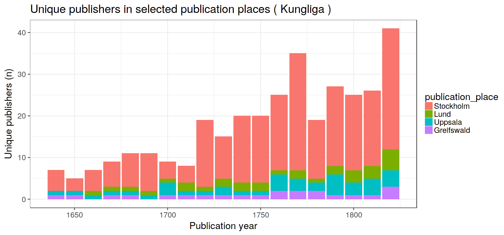

**Top publishers publishing profile**

Title count per top publisher (two alternative visualizations):

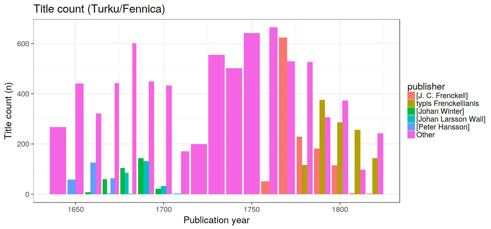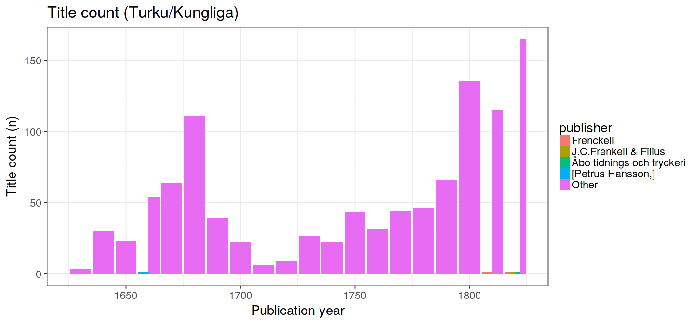

Paper consumption per top publisher (two alternative visualizations):

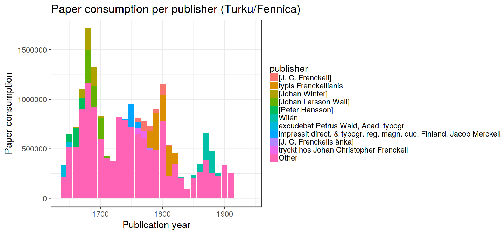

Tärkeänä kysymyksenä on mitä eri julkaisijat julkaisee. Top-5 julkaisijoista voisi tuottaa julkaisujen yhteiset, julkaisijakohtaiset asiasanalistat (mitä asiasanoja yhden julkaisijan kaikista töistä löytyy) jotka voitaisiin sitten käsin ryhmitellä isompiin kategorioihin (esim. yliopistojulkaisu, uskonnollinen teksti, säädökset, kaunokirjallinen ja muut (tai vast.)). Näin pystyttäisiin puhumaan siitä minkälainen julkaisija on kyseessä, muuttuuko profiili asiasanojen esiintymisen mukaan aikajanalla sekä nähdä onko julkaisijoiden kohdalla tässä mitään eroja.

OK, see lists for

-   [Frenckell Johan Christopher II](output.tables/subjecttopicsFrenckell_Johan_Christopher_II.tab)
-   [Frenckell Johan Christopher I](output.tables/subjecttopicsFrenckell_Johan_Christopher_I.tab)
-   [Hansson Peter](output.tables/subjecttopicsHansson_Peter.tab)
-   [Londicer Georg Wilhelm](output.tables/subjecttopicsLondicer_Georg_Wilhelm.tab)
-   [Wall Johan Larsson](output.tables/subjecttopicsWall_Johan_Larsson.tab)

**Londicer versus Frencell** “Siinä missä Londicer 1700-luvun Vaasassa näyttää aina julkaisseen asetukset jonkinlaisena kokoomapainoksena, mutta Frenckellin kirjapainosta ne tuli yksitellen. Siten Frenckellin julkaisemien niteiden määrä saattaa näyttää suurelta verrattuna Londiceriin, mutta itse asiassa sisältömäärä on sama”. Tätä hypoteesia voidaan yrittää todentaa/tarkistaa/korjata kun mukana on paperinkulutus. Eli jos verrataan Londicer ja Frenckell paperinkulutusta vuositasolla ja julkaisujen määrää, niin tästä pitäisi pystyä sanomaan jotain.


### Case of Turku

Turun akateemisen julkaisemisen vertautuminen muihin ruotsalaisen yliopistojärjestelmän kaupunkeihin: Lukumäärävertailut aikajanalla. Akateemisten julkaisujen blokkaaminenhan ei pitäisi olla kovinkaan hankalaa \[väitöskirjat, mitä muuta tähän siis?\].

Turku vs. muu Suomi: Turku osana ruotsalaista yliopistojärjestelmää (ml. Tarto) muuttuu tärkeäksi).

Kuinka paljon yliopistoon liittyvää julkaisutoimintaa

Kuinka paljon julkaisijoita

Miten julkaisijoiden verkosto muodostuu Turussa

Miten eri julkaisijoita Turussa voitaisiin luokitella (julkaiseeko joku paperinkulutukseltaan vain pieniä dokumentteja, julkaiseeko joku painotalo huomattavasti enemmän kuin toiset).

[Kungliga subject topics 1488-1828](figure_201606_Krakow/Kungliga_subjecttopics1488_1828.csv) **Voiko noita TODO Turku in Sweden kohtia nyt yksinkertaistaa? Poista mita ei enaa tarvitakaan**

[Kungliga subject topics Uppsala 1488-1828](figure_201606_Krakow/Kungliga_Uppsala_subjecttopics1488_1828.csv) **Voiko noita TODO Turku in Sweden kohtia nyt yksinkertaistaa? Poista mita ei enaa tarvitakaan**

**KUNGLIGAPUB-TODO1**: Tavoitteena asiasana-analyysi paikkakuntakohtaisesti liittyen yliopistojulkaisemiseen samalla tavalla kuin jo tehty Fennicasta. Ensimmäinen toimenpide: asiasanalistat Kungligasta 1480-1828 paikkakuntakohtaisesti: Tukholma, Lund, Greifswald, Uppsala, Turku, Lund, Tartu. Eli eri asiasanojan määrä eri kaupungeissa eri aikoina Kungligan mukaan. (Siis Eli samanlainen kaavio kuin on kielistä ”Book printing in Finland” –osiossa).

**KUNGLIGAPUB-TODO2**: Tuotetaan samanlaiset asiasanaryppäät kuin BOOKINFINLAND-5. Tämän jälkeen piirretään Kungligan pohjalta yliopisto-asiasanat aikajanalle samalla tavalla kuin Fennican kohdalla kaupunkikohtaisesti. Asiasanalista on seuraava. Käytin Fennican asiasanajaottelua pohjana, mutta Kungligan asiasanat ovat paljon modernimpaa kieltä ja yleensä seikkaperäisempiä. Jouduin siis soveltamaan aika paljon mikä tarkoittaa, että Fennican ja Kungligan vertailtavuus on heikko, mutta katalogin sisäisesti tilanne on hieman parempi. Osa kategorioista jäävät todella pieniksi (erityisesti toi retoriikka, poetiikka jne. En vain löytänyt niihin sopivia termejä). Tämä toki tiedettiin jo. 1. Kyrkohistoria; Biblisk arkeologi;Exegetik;Homiletik;Dogmatik;Teologi; Praktisk Teologi; Teologisk etik 2. Idé- och lärdomshistoria;Antiken;Historia;Militärhistoria; 3. Filosofi;Metafysik;Logik 4. Naturvetenskap;Matematik;Matematiska tabeller; Kemi;Astronomi;Geografi;Geologi;Meteorologi 5. Retorik 6. Hebreiska språket; Grekiska språket;Latin 7. Politisk filosofi;Ekonomiska förhållanden; Nationalekonomi;Lantbruksekonomi;Ekonomi;Penningväsen;Penningvärde;Kreditväsen;Penningförfalskning;Moral;Pedagogik;Uppfsotringsverket;Uppfostran;Barnuppfostran;Jordbruk;Jordbrukslära;Jordbrukspolitik;Fiske 8. Biologi;Medicinalverket;Medicin;Veterinärmedicin;Medicinalväsen;Medicinalväxkter;Sjukdomar;Djursjukdomar;Djur;Husdjur;Djurskydd;Hästar;Hästkreatur;Hästkörning;Hästavel 9. Kvinnor;Kvinnliga textilarbetare;Gravida kvinnor;Adelskvinnor;Kvinnorollen;Ensamstående kvinnor 10. Högmålsbrott;Skattebrott;Brott;Brottslingar;Äktenskapsbrott;Våldsbrott;Trafikbrott;Gäldenärsbrott;Sabbattsbrott;Sexualbrott;Fridsbrott;Ekonomisk brottslighet;Religionsbrott;Juridik;Straff;Dödsstraff;Kroppsstraff;Straffarbete;Straffarbete;Fängelsestraff

Uppsalan asiasanoista en saanut mitään uutta irti. Mitä näille tehdään?

**KUNGLIGAPUB-TODO 3**: Kaaviot Fennicasta ja Kungligasta, jossa lasketaan eri kaupunkien nimikemäärien, paperinkulutuksen ja kustantajien suhteellinen osuus vuoteen 1828. Eli samanlainen kaavio kuin on kielistä ”Book printing in Finland” –osiossa. Laaditaan kaaviot Tukholmasta, Uppsalasta, Lundista, Greifswaldista ja Turusta. Voiko myös tehdä erillisen kaavion, jossa Tukholma on poistettu, josta näkee näiden kilpailevien kakkoskaupunkien tilanteen?

**KUNGLIGAPUB-TODO 4** (jos ehtii ja pidetään järkevänä): Kun kerran ollaan maps and space sessiossa, ehkä kannattaisi tehdä myös kartta jossa, nämä eri kaupungit ja niiden nimikemäärät ovat kartalla, siis niin, että kullekin kaupungille tullee pallukka joka kooltaan vastaa julkaisujen määrää. Kartta kannattaisi tehdä vuosille 1650, ja 1800. Onko tämä mahdollista?

**PUBLISHER-TODO** (jos ehtii)

TODO\_Publisher analysis\_\#: Kaaviot Fennicasta, jossa lasketaan eri julkaisijoiden julkaisujen asiasanamäärä, siis samalla tavalla kuin tuolla yllä on tehty kielien asiasanojen kanssa. Asiasanat ovat osin arbriträärisiä, mutta ehkä niiden määrän pohjalta voidaan sanoa jotain eri julkaisijoiden profiilien muutoksista. Laaditaan kaaviot vuoteen 1828.

-   Fennican julkaisijoita voisi myös laajemmin yrittää luokitella suhteellisesti (“iso”, “keskikokoinen”, “pieni”) liittyen vuosittaiseen julkaisuvoluumiin jota mitataan niin julkaisujen määrän kuin myös paperinkulutusvoluumin suhteen. Tällä tavalla olisi helpompi hahmottaa eri kaupungeissa tapahtuvaa kehitystä. Vertailua suurimpien julkaisijoiden kesken.

-   AJATUKSIA: Julkaisijoiden ilmentyminen kartalle paperinkulutusvoluumi huomioiden: julkaisutoiminnan leviäminen ja kasvu ajassa eri paikkakunnilla. Paperinkulutus voi osoittautua hyväksi työvälineeksi erityisesti kun tiedetään, että toiset isot julkaisijat julkaisivat esim. jotain asetuskokoelmia yksittäin ja toiset taas ryppäinä. Eli julkaisijoiden sisällä erottelua eri tyyppisten julkaisujen suhteen pitää tehdä.

-   Julkaisijoista tehtävä verkostoanalyysi. keskeisimmät “nodet” siihen miten julkaisijakenttä muuttuu ajassa. Julkaisijoita voisi myös yrittää luokitella eniten käytettyjen asiasanojen mukaan. Näiden perusteella voidaan varmaankin erotella yliopistojulkaiseminen, asiakirja/asetusjulkaiseminen ja kirjajulkaiseminen. Tämän jälkeen auktorit, valtioasiakirjat, yliopistodokumentit, kirjat ja muut julkaisut kategoroina joiden ympärille verkostoanalyysi voisi syntyä (valtionasiakirjojen ja yliopisto-aineiston luokittelu voisi yhdistää myös asiasanojen ja otsikoiden analyysia). \[OK monenlaista voidaan tehdä, onko tämä asiasanajuttu nyt tärkeä vai vähemmän tärkeä prioriteetti?\]

**University publishing**

Yliopistojulkaisuista mahd. pian yleiset tilastolliset näkymät ja voidaan sitten arvioida onko joku mahdollisesti pahastikin vielä pielessä esim. väitöskirjoiksi Kungligan osalta luokiteltavissa aineistoissa.

Yleinen tilasto "väitöskirjaksi" merkityistä teoksista (aikajana, julkaisupaikka) olisi hyvä Kungligan osalta. Tämä toimii lähtökohtana että nähdään sisällöstä jotain: milloin niitä väitöskirja-luokiteltuja teoksia Kungligassa on merkitty julkaistuiksi sekä missä. Tämän vertaaminen Fennican pohjalta samaan eli "väitöskirjaksi" täggättyihin on tärkeää.

analyysi mitä julkaisukentällä tapahtuu eri paikoissa kun uusia julkaisijoita tulee kartalle (meneekö esim. jossain toisessa yliopistossa tuotanto suhteessa alas kun matkan varrella tulee uusia yliopistoja vai ei) jne.

Yliopistojen ilmestyminen ruotsinvaltakunnassahan on (ks. aikajanat):

Uppsala: 1477

Tartu / Dorpat / Tarto (eikös paikkakunnittain synonyymit toimi jo?): 1633

Turku: 1640

Lund: 1666

Greifwald: 1456 (Ruotsin systeemissä 1600-1815)

Greifswald mukaan yliopistoanalyysiin. osana Ruotsin valtakuntaa.

Tätä kautta päästään hyvin kiinni Turku, Upsala, Lund, Tarto yms. vertailuihin. Siitä sitten kuljetaan kohti Turun suhdetta muuhun Suomeen ja katso kääntyy erityisesti julkaisijoihin (samaten toki myös noiden yliopistokaupunkien osalla, jossa myös tehdään sitten vertailua akateeminen vs. hallinnollinen vs. muu julkaisutoiminta).

**Dissertation language** milloin alkaa erityisesti tulemaan ruotsinkielellä väitöksiä eri paikoissa on mielenkiintoinen kysymys. tuleeko jostain yliopistosta erityisesti ruotsinkielistä materiaalia 1700-luvulla. pitää erityisesti analysoida niitä väitöskirjoja sekä niissä tapahtuvia muutoksia. See [Fennica](https://github.com/rOpenGov/fennica/blob/master/inst/examples/language.md) and [Kungliga](https://github.com/rOpenGov/kungliga/blob/master/antagomir/language.md),

Vertailukohtia CERListä tai sitten ehkä ESTCstä pitää ottaa Fennicalle että pystytään suhteuttamaan mistä puhutaan \[verratkaa vaikka aiempiin julkaisuihin, ei sotketa enempää katalogeja nyt tähän soppaan ?\]

Ks myös Subject topics ainakin yliopisto-väitöskirjoihin liittyen.

tuleeko uusia kustantajia kenttään valtiopäivien myötä ?

-   Fennica pois lukien Suomi ?
-   Kungliga pois lukien Ruotsi ?

[Topic](https://github.com/rOpenGov/kungliga/blob/master/antagomir/topic.md) saadaanko mitään irti (1470-1830 tai 1640-1830).

Further todo points. Let us move in this manuscript only those points that there is time to do.

-   [Fennica TODO](https://github.com/rOpenGov/fennica/blob/master/inst/examples/TODO.md)
-   [Kungliga TODO](https://github.com/rOpenGov/kungliga/blob/master/antagomir/TODO.md)

Conclusions
-----------

Library catalogues contain rich metadata on...

Here we have analysed Fennica & Kungliga..

Further draft text in the funding application..?

Materials and Methods
---------------------

We obtained Fennica and Kungliga library catalogues from..

The raw data contains metadata 70001 and 381807 documents in Fennica and Kungliga, respectively. We limited the present analysis in the time interval 1488-1828, yielding a subset of 19670 (28.1%) and 72760 (0%) documents for Fennica and Kungliga, respectively.

We have prepared open data analytical ecosystem for in-depth analysis of such data collections ([Lahti, Ilomaki, Tolonen (2015)](http://doi.org/10.18352/lq.10112)). In summary, the data analytical ecosystem does .. Reading, parsing, cleaning up, enriching, summarizing, analysis, visualization, figures and tables.. \[SUMMARY FIGURE OF THE PROCESS?\]. Full source code to reproduce these analyses are available via Github ([Fennica](https://github.com/rOpenGov/fennica/); [Kungliga](https://github.com/rOpenGov/kungliga/)).

A brief summary of the data processing steps:

**Author names**

**Author life years**

**Publication place**

**Publishers**

**Dissertations**

**Duplicate removal** Combining the catalogs ..

**Enriching** to add gender, country, geocoordinates ..

The package utilizes tools from a number of other R extensions, including dplyr (Wickham and Francois, 2016), ggplot2 (Wickham, 2009), stats (R Core Team, 2016), tidyr (Wickham, 2016).

### Chunks transfered from slides for later use

\[Swedish Age of Freedom and Abolishment of Censorship\]

### 1766-1772 Title count vs. paper consumption (Kungliga)

Kungligan mukaan kuinka paljon enemmän Kungligassa julkaisujen lukumäärä ja paperinkulutus kasvaa kun sensuuri puuttuu vuosina 1766-1772 suhteessa tätä edeltävään kuuteen vuoteen.

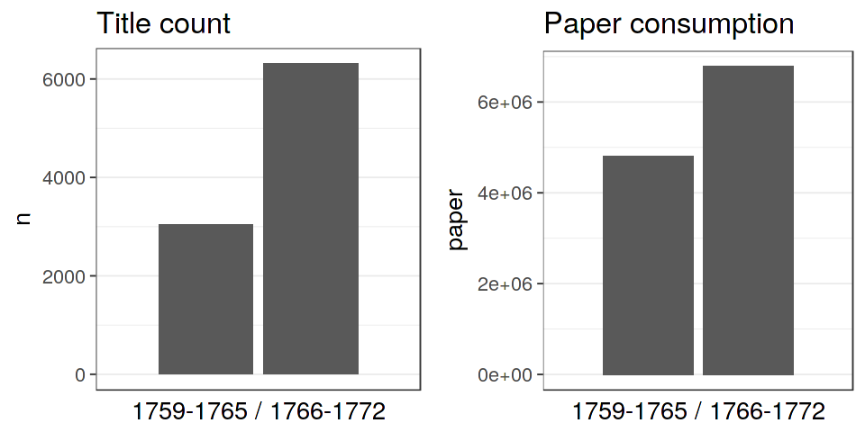

------------------------------------------------------------------------

\[University curriculum 4/5\]

### Printing of natural science in different languages in Turku


------------------------------------------

### DONE Kungliga subject topics (NEW!!)

Kyrkohistoria; Biblisk arkeologi;Exegetik;Homiletik;Dogmatik;Teologi; Praktisk Teologi; Teologisk etik

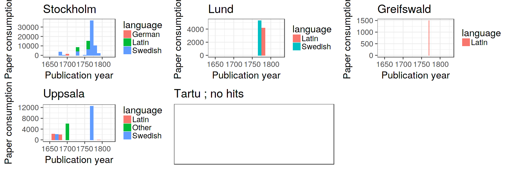

------------------------------------------------------------------------

Idé- och lärdomshistoria;Antiken;Historia;Militärhistoria;

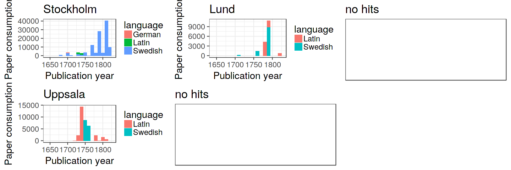

------------------------------------------------------------------------

Filosofi;Metafysik;Logik

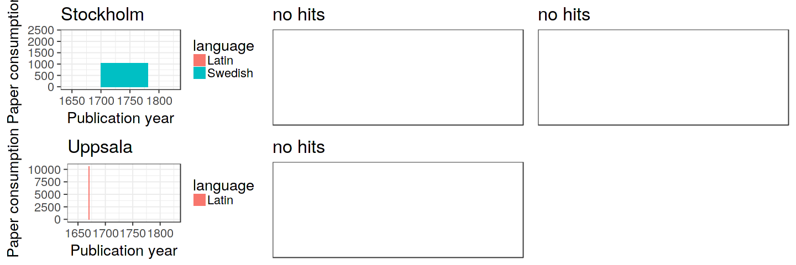

------------------------------------------------------------------------

1.  Naturvetenskap;Matematik;Matematiska tabeller; Kemi;Astronomi;Geografi;Geologi;Meteorologi

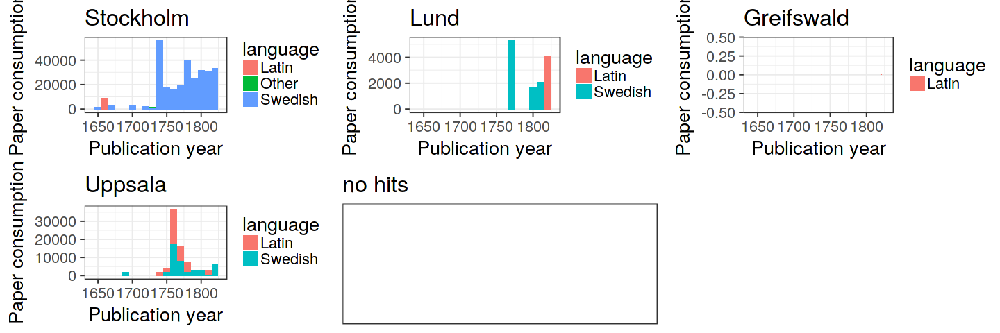

------------------------------------------------------------------------

1.  Retorik

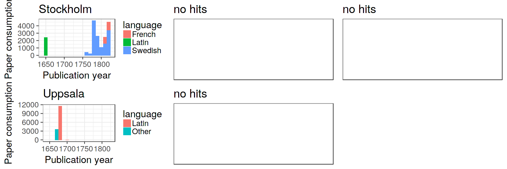

------------------------------------------------------------------------

1.  Hebreiska språket; Grekiska språket;Latin


------------------------------------------------------------------------

1.  Politisk filosofi;Ekonomiska förhållanden; Nationalekonomi;Lantbruksekonomi;Ekonomi;Penningväsen;Penningvärde;Kreditväsen;Penningförfalskning;Moral;Pedagogik;Uppfsotringsverket;Uppfostran;Barnuppfostran;Jordbruk;Jordbrukslära;Jordbrukspolitik;Fiske

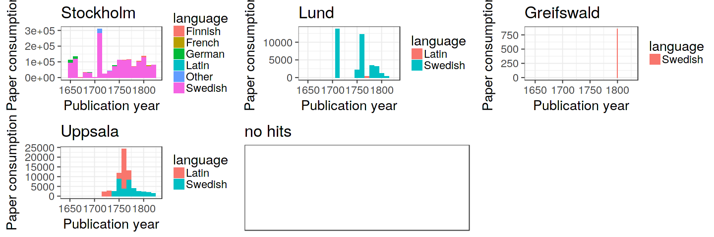

------------------------------------------------------------------------

1.  Biologi;Medicinalverket;Medicin;Veterinärmedicin;Medicinalväsen;Medicinalväxkter;Sjukdomar;Djursjukdomar;Djur;Husdjur;Djurskydd;Hästar;Hästkreatur;Hästkörning;Hästavel

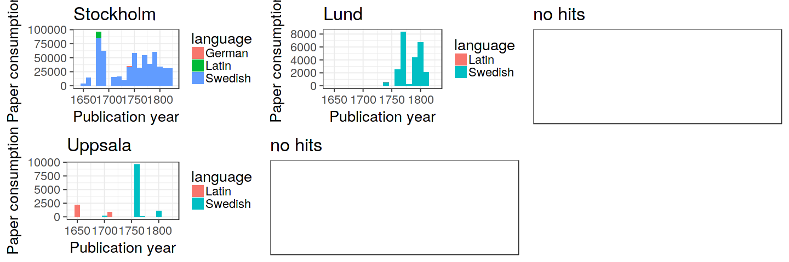

------------------------------------------------------------------------

1.  Kvinnor;Kvinnliga textilarbetare;Gravida kvinnor;Adelskvinnor;Kvinnorollen;Ensamstående kvinnor

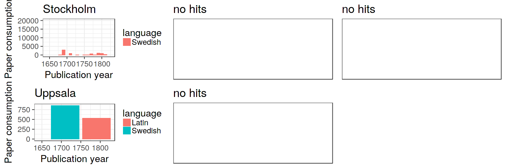

------------------------------------------------------------------------

1.  Högmålsbrott;Skattebrott;Brott;Brottslingar;Äktenskapsbrott;Våldsbrott;Trafikbrott;Gäldenärsbrott;Sabbattsbrott;Sexualbrott;Fridsbrott;Ekonomisk brottslighet;Religionsbrott;Juridik;Straff;Dödsstraff;Kroppsstraff;Straffarbete;Straffarbete;Fängelsestraff

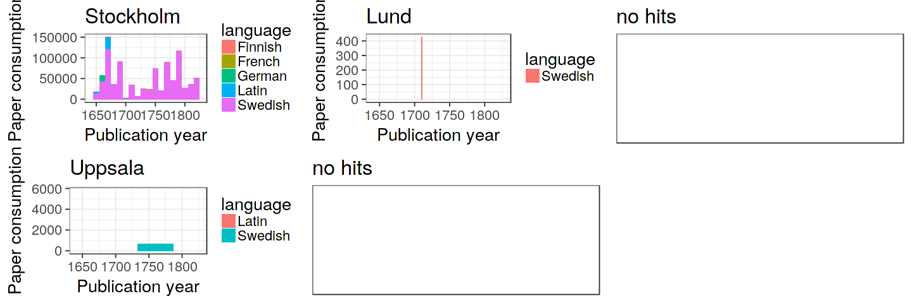
----------------------------------------

\[Swedish Age of Freedom and Abolishment of Censorship 2/3\]

### Number of publishers in Stockholm 1760-1770


--------------------------------------------------------------

### Finland in the Swedish context

-   Dramatic events regarding the diversity of "Finnishness" take place in the early nineteenth century --- but the analysis of Finnish knowledge production 1828-2016 is for another day.


---------------------------------------------------------

\[Publishers 5/6\]

### Comparing paper used on average per publication by publishers

TODO: Mikä kustantaja Sverige on? LL: originaalidatan publisher-kenttä on tässä kohden tyhjä. Veikkaan että tähän on täydennetty materiaalia muistakin kentistä. Pitää katsoa Hegen kanssa tarkemmin mikä on Sverige koska publisher-kenttä tulee hänen koodeilla.


------------------------------------------------------------------------

\[Languages & religious texts in Finland\]

### Development of use of different languages in Finnish National Bibliography


--------------------------------------------------------------------------------------------------------------------------------

\[Languages\]

### Development of use of different languages in Kungliga data


--------------------------------------------------------------------------------------------------------------------------------------------------

\[Languages & religious texts in Finland\]

### Combining devotional literature and temporary sermons


------------------------------------------------------------------------

\[Publishers\]

Asiasanoja / yliopistopaikkakunta vertailu Kungligasta. Ts. mitä enemmän eri aikoina asiasanoja (ihan sama mitä ne on) paikkakunnalla, sitä monimuotoisempaa/rikkaampaa julkaisutoiminta?

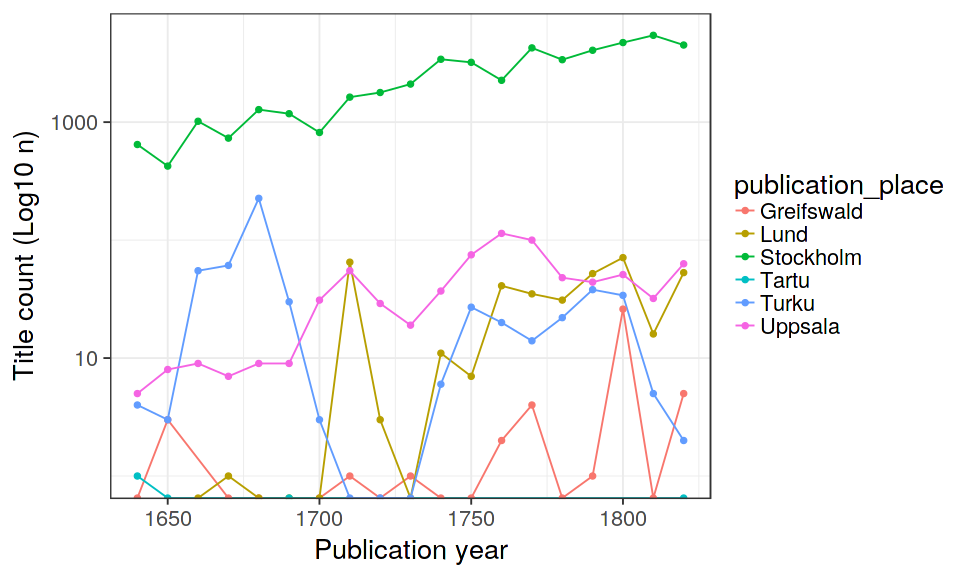

------------------------------------------------------------------------

\[University curriculum & Enlightenment in Finland\]

### Printing of theology in different languages in Turku

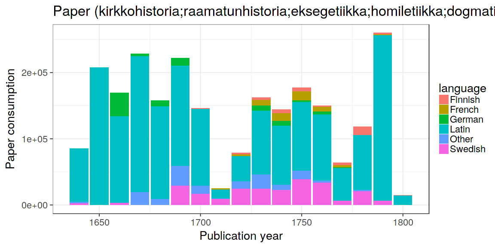
------------------------------------------

\[Publishers in Sweden and Turku\]

### Rock Bottom of the Great Northern War (1700-1721)

Publisher title count changes around 1700 with a nearly detrimental drop in Turku, significant publishing place in Finland at the time.


TODOja KRAKOVAN JÄLKEEN tehtäviä:

Vaasan merkitys Turun rinnalla 1700-luvun lopulla. Tämä pitää ottaa mukaan analyysiin. Todella mielenkiintoinen case joka myös näkyy tuossa kokonaiskuvassa. Tästä siis tarkemmat analyysit.

------------------------------------------------------------------------

### Acknowledgements

Supported by Academy of Finland (grant 293316).

References
----------

### References

\[1\] H. Wickham. *ggplot2: Elegant Graphics for Data Analysis*. Springer-Verlag New York, 2009. ISBN: 978-0-387-98140-6. &lt;URL: <http://ggplot2.org>&gt;.

\[2\] L. Lahti, N. Ilomäki and M. Tolonen. "A quantitative study of history in the English short-title catalogue (ESTC) 1470-1800". In: *LIBER Quarterly* 25.2 (Dec. 2015), pp. 87-116. ISSN: 2213-056X. &lt;URL: <http://liber.library.uu.nl/index.php/lq/article/view/10112>&gt;.

\[3\] L. Lahti, N. Ilomäki and M. Tolonen. "A Quantitative Study of History in the English Short-Title Catalogue (ESTC), 1470-1800". In: *LIBER Quarterly* 25.2 (Dec. 2015), p. 87. DOI: 10.18352/lq.10112. &lt;URL: <http://dx.doi.org/10.18352/lq.10112>&gt;.

\[4\] M. Tolonen and L. Lahti. "Aatehistoria ja digitaalisten aineistojen mahdollisuudet". In: *Ennen & Nyt 2* 2 (Aug. 2015). &lt;URL: <http://www.ennenjanyt.net/2015/08/aatehistoria-ja-digitaalisten-aineistojen-mahdollisuudet>&gt;.

\[5\] R Core Team. *R: A Language and Environment for Statistical Computing*. R Foundation for Statistical Computing. Vienna, Austria, 2016. <URL: https://www.R-project.org/>.

\[6\] H. Wickham. *tidyr: Easily Tidy Data with `spread()` and `gather()` Functions*. R package version 0.5.1. 2016. &lt;URL: <https://CRAN.R-project.org/package=tidyr>&gt;.

\[7\] H. Wickham and R. Francois. *dplyr: A Grammar of Data Manipulation*. R package version 0.5.0. 2016. &lt;URL: <https://CRAN.R-project.org/package=dplyr>&gt;.

Miscellaneous ideas to consider
-------------------------------

[ESTC-analyses](https://github.com/rOpenGov/estc) ([LIBER](https://github.com/rOpenGov/estc/blob/master/inst/examples/20151023-LIBER.md) in particular); toisto Fennica/Kungliga datoilla ? LL: lisäilin joitain analyyseja tahan mutta jos tahdotte lisaa niin pyytakaa erikseen.

The most active known female authors based on the title count:


------------------------------------------------------------------------

Session info
------------

This document was created with the following versions:

``` r
sessionInfo()
```

    ## R version 3.3.1 (2016-06-21)
    ## Platform: x86_64-pc-linux-gnu (64-bit)
    ## Running under: Ubuntu 16.04 LTS
    ## 
    ## locale:
    ##  [1] LC_CTYPE=en_US.UTF-8       LC_NUMERIC=C              
    ##  [3] LC_TIME=en_US.UTF-8        LC_COLLATE=en_US.UTF-8    
    ##  [5] LC_MONETARY=en_US.UTF-8    LC_MESSAGES=en_US.UTF-8   
    ##  [7] LC_PAPER=en_US.UTF-8       LC_NAME=C                 
    ##  [9] LC_ADDRESS=C               LC_TELEPHONE=C            
    ## [11] LC_MEASUREMENT=en_US.UTF-8 LC_IDENTIFICATION=C       
    ## 
    ## attached base packages:
    ## [1] stats     graphics  grDevices utils     datasets  methods   base     
    ## 
    ## other attached packages:
    ##  [1] knitcitations_1.0.7   stringr_1.0.0         microbiome_0.99.87   
    ##  [4] phyloseq_1.16.2       knitr_1.13            gridExtra_2.2.1      
    ##  [7] reshape2_1.4.1        tidyr_0.5.1           ggplot2_2.1.0        
    ## [10] magrittr_1.5          fennica_0.1.43        bibliographica_0.2.28
    ## [13] sorvi_0.7.47          tibble_1.1            dplyr_0.5.0          
    ## [16] devtools_1.12.0      
    ## 
    ## loaded via a namespace (and not attached):
    ##   [1] colorspace_1.2-6      rjson_0.2.15          deldir_0.1-12        
    ##   [4] babynames_0.2.1       rgdal_1.1-10          dynamicTreeCut_1.63-1
    ##   [7] XVector_0.12.0        roxygen2_5.0.1        lubridate_1.5.6      
    ##  [10] AnnotationDbi_1.34.3  RefManageR_0.10.13    codetools_0.2-14     
    ##  [13] splines_3.3.1         doParallel_1.0.10     impute_1.46.0        
    ##  [16] tgp_2.4-14            ade4_1.7-4            Formula_1.2-1        
    ##  [19] jsonlite_1.0          Cairo_1.5-9           WGCNA_1.51           
    ##  [22] cluster_2.0.4         GO.db_3.3.0           httr_1.2.1           
    ##  [25] assertthat_0.1        Matrix_1.2-6          lazyeval_0.2.0       
    ##  [28] formatR_1.4           acepack_1.3-3.3       htmltools_0.3.5      
    ##  [31] tools_3.3.1           igraph_1.0.1          NLP_0.1-9            
    ##  [34] coda_0.18-1           gtable_0.2.0          gmodels_2.16.2       
    ##  [37] Rcpp_0.12.7           slam_0.1-35           Biobase_2.32.0       
    ##  [40] RJSONIO_1.3-0         Biostrings_2.40.2     multtest_2.28.0      
    ##  [43] spdep_0.6-5           gdata_2.17.0          ape_3.5              
    ##  [46] preprocessCore_1.34.0 nlme_3.1-128          iterators_1.0.8      
    ##  [49] fastcluster_1.1.20    gender_0.5.1          testthat_1.0.2       
    ##  [52] gtools_3.5.0          XML_3.98-1.4          stringdist_0.9.4.1   
    ##  [55] LearnBayes_2.15       zlibbioc_1.18.0       MASS_7.3-45          
    ##  [58] scales_0.4.0          parallel_3.3.1        biomformat_1.0.2     
    ##  [61] genderdata_0.5.0      rhdf5_2.16.0          RColorBrewer_1.1-2   
    ##  [64] yaml_2.1.13           memoise_1.0.0         rpart_4.1-10         
    ##  [67] latticeExtra_0.6-28   stringi_1.1.1         maptree_1.4-7        
    ##  [70] RSQLite_1.0.0         highr_0.6             S4Vectors_0.10.1     
    ##  [73] foreach_1.4.3         permute_0.9-0         BiocGenerics_0.18.0  
    ##  [76] boot_1.3-18           bibtex_0.4.0          chron_2.3-47         
    ##  [79] bitops_1.0-6          moments_0.14          matrixStats_0.50.2   
    ##  [82] evaluate_0.9          lattice_0.20-33       labeling_0.3         
    ##  [85] plyr_1.8.4            gisfin_0.9.26         R6_2.1.2             
    ##  [88] IRanges_2.6.1         Hmisc_3.17-4          DBI_0.4-1            
    ##  [91] foreign_0.8-66        withr_1.0.2           mgcv_1.8-12          
    ##  [94] RCurl_1.95-4.8        survival_2.39-5       sp_1.2-3             
    ##  [97] nnet_7.3-12           crayon_1.3.2          rmarkdown_0.9.6.14   
    ## [100] grid_3.3.1            data.table_1.9.6      vegan_2.4-0          
    ## [103] digest_0.6.9          tm_0.6-2              stats4_3.3.1         
    ## [106] munsell_0.4.3
