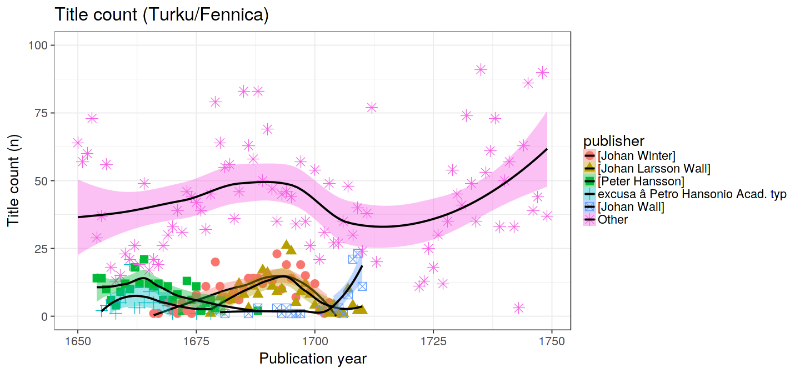
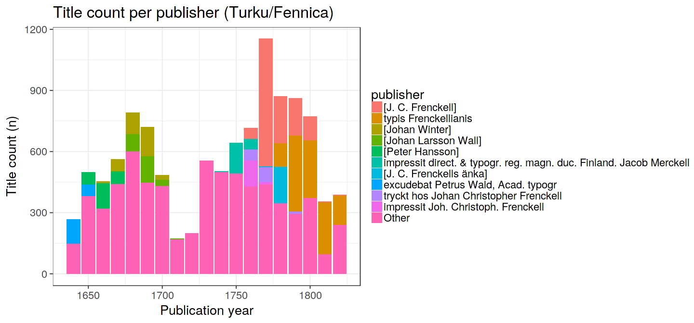
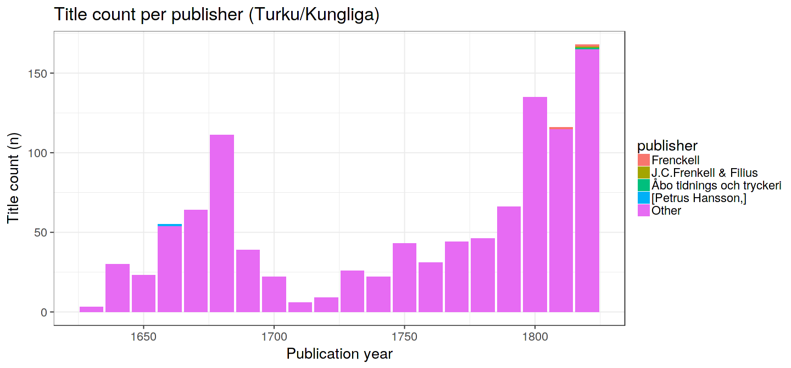
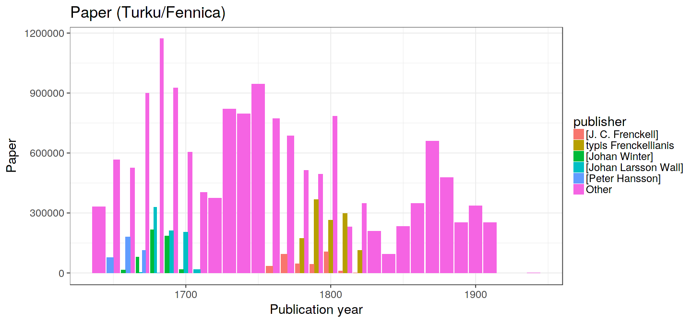
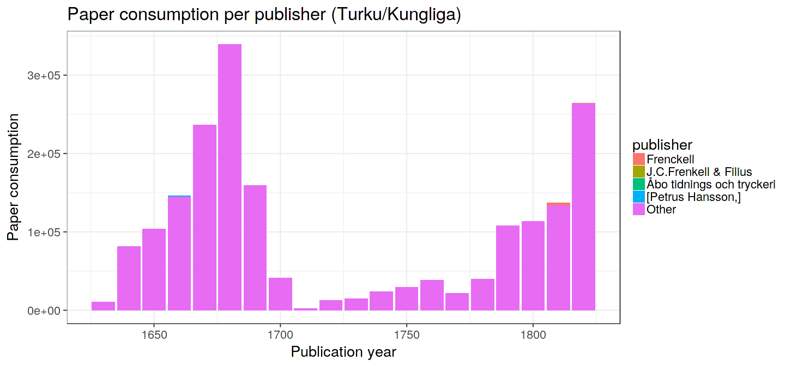
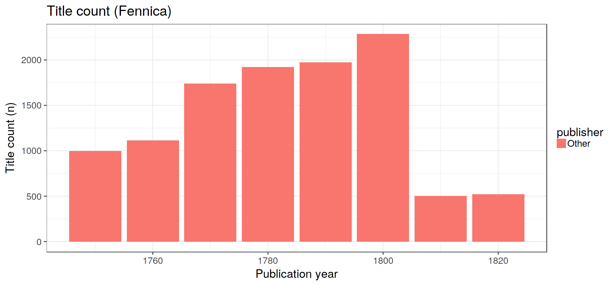
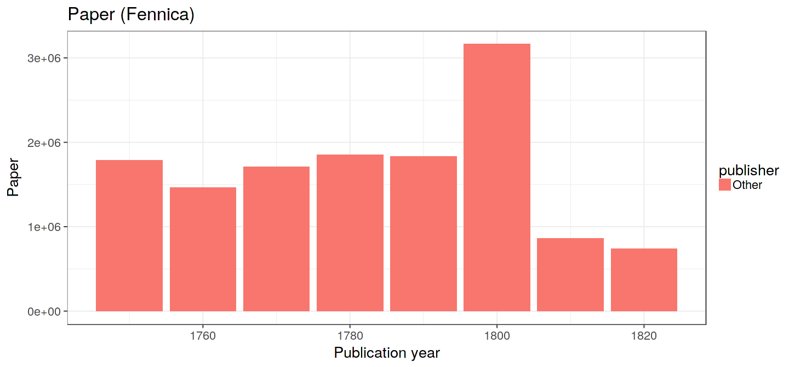

<!--
  %\VignetteEngine{knitr::rmarkdown}
  %\VignetteIndexEntry{microbiome tutorial}
  %\usepackage[utf8]{inputenc}
-->
Printing in a Periphery: a Quantitative Study of Finnish Knowledge Production, 1640-1828
========================================================================================

TODO-järjestyksestä:

Tärkein ASAP tehtävä on **Publisher analysis**

Selvensin alle (Publisher analysis kohtaan): PUBLISHER-TODO1 ja PUBLISHER-TODO2. Lisäksi löytyy muita ajatuksia.

Muiden osalta (voi tehdä jo ilman publisher kenttää), järjestys: **Book printing in Finland** - kohdasta \* BOOKINFINLAND-TODO1 ja \* BOOKINFINLAND-TODO2.

Eli aloita BOOKINFINLAND-TODOilla ja kun julkaisijakenttä tsekattu, niin heti Publisher analysis kohtaan ja PUBLISHER-TODOt. Samalla Marjanen ja minä siivotaan näitä muita analyysi-ideoita toteuttamiskelpoisiksi ohjeiksi. Jani voi tehdä tätä omatoimisesti myös.

Lisäsin alle seuraavat TODO:t: TODO\_Political events 1, TODO\_Turku in Sweden 1, TODO\_Turku in Sweden 2, TODO\_Publisher analysis\_\#, TODO\_Publishing in Finland \# ja TODO\_Publishing in Finland\_kieliolosuhteet\_muualla 1. Ovatko nämä toteuttamiskelpoisia?

Introduction
------------

Matti Klinge HYn historia; Jari Niemelä, Vain hyödynkö tähden (väitöskirja) käsittelee Turun yliopiston asemaa.

Östholm, Hanna, Litteraturens uppodling : läsesällskap och litteraturkritik som politisk strategi vid sekelskiftet 1800; vertailee Turkua ja Uppsalaa lukuseurojen kautta.

Grönroos, Henrik & Nyman, Ann-Charlotte, Boken i Finland, 1996.

Suomen taloushistoria, Historiallinen tilasto 3, 1983.

Vasenius, Valfrid, Suomalainen kirjallisuus, 1544-1877, 1878.

Gardberg, Carl-Rudolf, Kirjapainotaito Suomessa I-III, 1949-1973.

Heininen, Simo, Ulkomaisen kirjallisuuden tulo Suomeen 1531-1600. SKHSV, 1991.

Häkli, Esko, Näin syntyi ja säilyi suomalainen kirja, 1989.

Laine, Tuija, Vanhimman suomalaisen kirjallisuuden käsikirja, 1997.

Vieraskielinen kirjallisuus Suomessa Ruotsin vallan aikana.

Wittman, Reinhard, Was there a reading revolution at the end of the eighteenth century? A history of reading in the west. Cambridge, 2003.

Aatehistoria ja digitaalisten aineistojen mahdollisuudet (Tolonen and Lahti, 2015)

We have prepared open data analytical ecosystem for in-depth analysis of such data collections (Lahti, Ilomäki, and Tolonen, 2015).

You can cite with the DOI (the citation info will then be collected automatically): (Lahti, Ilomäki, and Tolonen, 2015) or alternatively add new references to the [bib file](bibliography.bib) and then cite using the key with (Lahti, Ilomäki, and Tolonen, 2015). Such citations will be automatically numbered and collected in references section.

-   Knowledge production has been approached largely through a national perspective, here we shift focus by combining materials from Sweden and Finland and by specifically looking at cities as sites for knowledge production. Cities are to this effect seen as partly supplementing, partly competing intellectual centres.

Results
-------

MT: We are in a session called "MAPS and SPACE", so I think we need to have some of the results presented on a map. Now, the question is what is possible to do within this time? But perhaps the publishing houses should be included in this?

Why Fennica has huge drop in 1700s? Do some publisher disappear (TODO)? Let us look at top publication places during the period 1650-1750 in Fennica:


The drop in Fennica is explained largely by Great Nortern War (1700-1721). The war and difficult times seems to hit Turku particularly hard in early eighteenth century. What is telling also is that the curve of overall publishing activity in Kungliga is much steeper in eighteenth century compared to Fennica also in the second half of the century. This is the Enlightenment’s rising trend of knowledge production in most of Europe (for example ESTC has a similar development with Kungliga). Thus, development of publishing in Finland is much slower compared to larger European centers in the eighteenth century – this is an important context for the even further difficulties that follow after 1828.

The following figure highlights publisher title count changes around 1700 drop in Turku, the most significant publishing place at the time:



Here the same for the complete Fennica:


TODO: try check duplicates. Clustering with identical place, identical year, near identical title and then print table with potential duplicates for manual checks. - LL: you mean something different from what HR already did ? Duplicates within Fennica, or duplicates between Fennica vs Kungliga ? To be removed from all analyses, or a specific figure ?

Paper per title count ratio per publisher. \[nähdään voidaanko sanoa onko joku selkeästi asetusten julkaisija ja toisella myös kirjoja (tai asetuskokoelmia).\]


### General trends: Fennica vs. Kungliga

-   [Fennica overview](https://github.com/rOpenGov/fennica/blob/master/inst/examples/overview.md)
-   [Kungliga overview](https://github.com/rOpenGov/kungliga/blob/master/antagomir/overview.md)

Top-author timelines. Putsaus ok (näistä tsekattu, että ei löydy ainakaan isoa määrää laskuista puuttuvia nimivariantilla julkaistuja teoksia). Kungligassa väitöskirjat näyttelevät huomattavasti pienempää osaa kuin Fennicassa. Näkyy näistä top-auktori kuvista.


Fennica yhteenvedoissa on EDITIONS kohta. Kuvia mahdollista saada? On nimittäin mielenkiintoinen kysymys. LL: ok lisasin tan sinne - voin elaboroida lisaa jos on ehdotuksia: MT: otetaan tarkasteluun ainoastaan sellaiset julkaisut joista on enemmän kuin yksi editio. Eli editioita pitää olla kaksi tai useampi, että lasketaan mukaan. Näistä sitten tarkastellaan ainoastaan sen ensimmäisen edition ilmestymistä. Lisäksi voisi piirtää toisen kuvan jossa tarkastellaan muita kuin sen ensimmäisen edition ilmestymistä (eli toinen, kolmas jne. editiot).


Overall development in publishing activity:


The top publication places ranked by the title count


Comparison of printing activity in Turku, Uppsala, Lund, and Stockholm. Turussa julkaiseminen alkaa vasta 1640-luvulla, mutta ollaan kiinnostuttu ruotsalaisesta julkaisemisesta ennen sitä. Esim miten Turun yliopiston perustaminen vaikuttaa ruotsalaiseen julkaisukenttään 1600-luvun aikana.

I can provide percentages instead of counts, or paper consumption estimates (not reliable yet, though), barplots, selected time spans, selected places etc.. just let me know what is needed.


### Effects of historical events

**Riksdagar** are in some cases associated with publishing peaks (see Figure ...). See "Vapauden ajan valtiopäivät" from 1719 onwards ?

In particular: Riksdag Stockholm 20 januari 1719 1 juni 1719; Stockholm 14 maj 1734 14 december 1734; Stockholm 21 februari 1765 21 oktober 1766; Norrköping & Stockholm 22 april 1769 5 februari 1770; Stockholm 19 juni 1771 12 september 1772; Gävle 26 januari 1792 24 februari 1792.

The publishing of historical works in .. on a timeline highlighting the eras of the riksdagar (16..-16..)..

**Painovapaus**, 1766, räjähtääkö / kasvaako julkaiseminen merkittävästi ja miten tämä näkyy Tukholma vs. muu valtakunta (ml. Turku)? Painovapaus on 1766-1772, miten tämä näkyy ?


Focus on Gävle (gray) during riksdagar. Gävle has 0 occurrences in Fennica, hence not included here. The figure on Gävle is based on Kungliga.


TODO\_Political events 1: Kaaviot Tukholmasta, Uppsalasta, Lundista, Greifswaldista ja Turusta ajalle 1860-1880, joissa näkyy vuosittain julkaisumäärät, arvio paperinkulutuksesta ja kustantajien määrästä. Nämä pitää tehdä erikseen Fennicasta ja Kungligasta, eli yhteensä kuusi kaaviota. Tärkeää, että saadaan jokaisesta vuodesta oma piste/luku. Trendiviiva ei ole kovinkaan kiinnostava, koska tässä yritetään selvittää sitä millä tavalla painovapausaika (1766-1774) erottuu materiaalissa. Yksi aikaisemman tutkimuksen väitteistä on se, että pamflettikirjoittelu räjähtää tänä aikana. Tätä testataan vertaamalla paperinkulutusta ja nimikkeiden määrää. Julkaisijoiden määrän kasvu näkyy Kungligan materiaalissa Tukholman osalta ja Turunkin osalta päästään kymmeneen julkaisijaan joten verrataan tätä muihin kaupunkeihin. Synnyttääkö painovapaus uusia julkaisijoita (vastaus on kyllä)?

Title counts in selected places in the Kungliga catalogue.


Kungliga publications outside Sweden and Finland.


### Book printing in Finland

Mitä voidaan sanoa suomalaisesta kirjatuotannosta ylipäänsä sekä löydetäänkö sieltä mitään mielenkiintoisia kehityskulkuja ylipäänsä vai pelkästään toteamus, että suomalainen tiedontuotanto oli hyvin vähäistä tarkastellulla ajanjaksolla.

Kielikohtainen yleinen vertailu julkaisumääristä ja paperinkulutuksesta. Eli kaksi kuvaa (julkaisumäärät ja paperinkulutus kielittäin). Miten kielten kehitys suhtautuu toisiinsa (suomi kasvaa, latina laskee jne.)? Tarkkailtavia kielikategorioita on 5: suomi, ruotsi, latina, saksa sekä kategoria jossa kaikki muun kielisiset kuin edellä mainitut niputetaan yhteen. TÄYDENNYS: Venäjän ja ranskankielisestä aineistosta omat graafit myös.


Analyysi voi tapahtua aikajanalla, mutta voisi myös ajatella suhteellista kehitystä tässä jollain muulla esitystavalla, olisiko se sitten jonkinlainen prosenttianalyysi? Tämä analyysi kannattaa jatkaa myös pidemmälle kuin 1828 Fennican osalta.


Tärkeää on vertailu, mutta myös että nähdään kielikohtainen kehitys. Täten esim. pienemmän saksankielen kohdalla kannattaa varmaan piirtää erillinen kuva.


TODO\_Publishing in Finland\_kieliolosuhteet\_muualla 1: Greifswaldin kieliprofiili vuoteen 1828 asti (käytännössä 1815) Kungligan materiaalin osalta. Onko Greifswaldissa samanlainen kielimonimuotoisuus läsnä kuin Turussa?

### BOOKINFINLAND-DONE2

Fennica, Hartaus- yms. kirjallisuuden kieli (suomi vai ruotsi) milloin alkaa yleistyä suomenkielinen ja miten tämän julkaiseminen suomeksi kasvaa? Toteutus, valitaan kaikki teokset joihin liittyy joku seuraavista asiasanoista: virret;arkkiveisut;hartauskirjat;katekismukset;rukouspäivät;saarnat;aapiset;rukoukset;rukous;hengelliset laulut;hartauspuheet;virsikirjat. Tämän jälkeen tarkkaillaan aikajanalla näiden teosten esiintymistä, erottavana tekijänä kieli (samat 5 kategoriaa kuin edellisessä analyysissä). Erilaisia tarkkailukulmia. Tämä analyysi kannattaa jatkaa myös pidemmälle kuin 1828 Fennican osalta. MT: Korjataan tätä kommenttia. Tässä data ei riitä siihen että kannattaa analyysia jatkaa. Eli siis 1828 takalautana kaikissa kuvissa. Näin viilaamalla noista erittäin hyvistä kuvista tuossa alla (ja kohdassa BOOKINFINLAND-DONE4) tulee vielä parempia.

TODO: Kungligan subject topiceista voisi tuottaa vastaavat niputettavat asiasanaryhmät Kungligalle (Jani ja Mikko): <https://github.com/rOpenGov/kungliga/blob/master/output.tables/subject_topic_accepted.csv> Näistä sitten oma analyysi joka suhtautuu Fennicaan.

NOTE: Kungliga is missing those subject topics hence skipped.

General analysis with all documents combined:


Same with selected publication places:


Same with top publishers


### BOOKINFINLAND-DONE3

Sama kuin edellä, mutta asiasanat tässä: hautajaiset;häät;juhlamenot

General analysis with all documents combined:


Same with selected publication places:


Same with top publishers


### BOOKINFINLAND-DONE4

edellisten yhdistäminen, eli täsmälleen samat analyysit, mutta asiasanoina kaikki (todo2 ja todo3), eli: virret;arkkiveisut;hartauskirjat;katekismukset;rukouspäivät;saarnat;aapiset;rukoukset;rukous;hengelliset laulut;hartauspuheet;virsikirjat;hautajaiset;häät;juhlamenot

Hartauskirjallisuudesta ks. Osmo Tiililä, Rukoilevaisten kirjoja, 1961.

General analysis with all documents combined:


Same with selected publication places:


Same with top publishers


### BOOKINFINLAND-DONE4

Kielikohtainen vertailu myös lääketieteen osalta. Ajatuksena tässä on, että hartauskirjallisuutta on hyvä verrata tiedejulkaisemiseen. 1800-luvun jukisuuteen kuuluu vahvasti tarina kansallisista tieteista (historia, suomen kieli, folkloristiikka jne), ja niissä suomenkielen nusu on aika hyvin selvitetty juttu. Sama koskee tiedejulkaisemista, mutta siinä argumentit olivat erilaiset. Tästä on Katja Huumon väitöskirja ”Perkeleen kieli”, jossa käydään laadullisen tutkimuksen kautta tieteen kielikiistoja 1800-luvulla. Ajattelen, että lääketieteen osalta asiasanat ovat ehkä kaikkein luotettavimmat, joten voisi tarkastella lääketiedettä ja verrata siihen hartauskirjallisuuteen. Hartauskirjallisuuden osaltahan pyrkimys suomeksi julkaisemiseen oli kovin vahva koska se tieto oli kansalle tärkeää. Lääketieteellinenkin tieto kansallistettiin, mutta myöhemmin.

Eli: Fennicasta kaikki kirjallisuus, jossa asiasana lääketiede (muut lääkeaiheiset eivät välttämättä kuulu tähän, noita on muuten kummallisen vähän). Tätä pitää jatkaa mielellään vuoteen 1900 asti, tai ainakin yhtää pitkälle kuin hartauskirjojakin.

Title count for different places. Fennica, no time limit.

    ## 
    ##       Jena      Pärnu  Stockholm Wittenberg  Göttingen Greifswald 
    ##          1          1          1          1          2          2 
    ##     Leiden       Lund      Tartu    Uppsala      Turku 
    ##          2          2          7         40        104

General analysis with all documents combined:


Kaupungittain vertailu on kiinnostavaa, koska tuntuma on, että Turun ja Helsingin osalta ei latinan, ranskan ja saksankielista matskua pitäisi löytyä. Silloin vernakularisointi tapahtuu erityisesti muualla. HUOM: Helsingissä ei ole painettu mitään asiasanalla lääketiede.

Huumo, Katja. "Perkeleen kieli" : suomen kieli ja poliittisesti korrekti tiede 1800-luvulla, Helsinki : Suomen tiedeseura, 2005.


TODO\_Publishing in Finland \#: Kaaviot Fennicasta, jossa lasketaan eri kielten mukaan asiasanojen määrä eri vuosina. Asiasanat ovat osin arbriträärisiä, mutta ehkä niiden määrän pohjalta voidaan sanoa jotain siitä millä kielellä on julkaistu mitäkin. Minusta voisi tehdä kaavion vuoteen 1828 sekä toisen vuoteen 1900. Tiedän että 1800-luvun osalta Fennicassa on kielellinen bias, mutta esim. suomenkielen tarkastelun kannalta tällä ei ole merkitystä, sillä kaikki suomenkielinen materiaali on tarkkaan läpikäytyä. Tässä näky toivottasti se millä tavalla 1855 jälkeen suomenkielinen julkaiseminen laajeni. Kaavio joka näyttää asiasanat vuoteen 1828 auttaa toivottavasti asettamaan 1700-luvun suomenkielisen hartauskirjallisuuden kontekstiinsa.

### BOOKINFINLAND-5

Samat analyysit kuin yllä, seuraavat asiasanaryppäät. Tarkoituksena analysoida yliopisto-opetuksen muutosta. Kokonaismäärät ja kielikohtaiset vaihtelut kiinnostavat.

1.  kirkkohistoria;raamatunhistoria;eksegetiikka;homiletiikka;dogmatiikka;teologia

2.  oppihistoria;antiikki;historia

3.  filosofia;luonnonfilosofia;metafysiikka;logiikka

4.  luonnontieteet;matematiikka;fysiikka;kemia;tähtitiede;maantiede;geodesia;geofysiikka;meteorologia

5.  retoriikka;poetiikka;kielitiede;kielioppi

6.  heprean kieli;kreikan kieli;latinan kieli

7.  psykologia;yhteiskuntafilosofia;valtiofilosofia;talous;raha;moraali;velvollisuudet;kasvatus

8.  luonnonhistoria;lääketiede;tartuntataudit;eläintiede;kasvitiede;kasvisto;eläimet;eläinsuojelu;eläimistö;eläintaudit;hevonen;maanviljely;maatalous;kalastus

9.  naiset;naisen asema;naisasialiikkeet;naisasiajärjestöt

10. etsintäkuulutukset;rikokset;oikeus;rangaistukset

Näissä kiinnostaa myös julkaisijakohtaiset vaihtelut (tai oikeastaan kaikki kuvat joita esim. BOOKINFINLAND-4:ssa. Tämä vain jatkaa siitä mihin tuo edellinen jää.

### Book as media: development over time

Paper consumption per document in the top publication places. Note that paper consumption estimates have still problems so take this with reservations. Are there time periods with remarkable changes in paper consumption per document (meaning that small or large volumes suddenly become more frequent) ?


Overview on how over 50 page documents spread in time. Paper consumption in books (over 50 pages; balls) versus other documents (less or equal than 50 pages; triangles). TODO: voidaanko tässä nähdä paikallisia eroja ?


Average paper consumption per document over time:


The development of book formats over time. Folios (1to ja 2to) are largely missing (in contrast to ESTC). Moreover, the quarto (4to) and octavo (8vo) increase rapidly in 1700s.


Paper consumption for different document formats over time. Each point represents a decade. Loess smoothing.


Tässä on meille tärkeät kuvat. Erityisesti paper consumption (Kungliga) kertoo Valistuksen voittokulusta Euroopassa. Octavo kokoisten kirjojen paper consumption on merkki kirjojen merkityksen korostumisesta ja muutoksesta. Sama päti ESTCn. Suomi taas tulee tässä orastavasti perässä kirjatuotannon puolesta. Mitä me halutaan sanoa tästä suomalaisen sivistysvaltion myöhemmästä kehityksestä?

Paper consumption in selected places (Fennica):


### Dynamics and evolution of publisher networks

Observed trends in Fennica regarding Finnish knowledge production 1640-1828, focusing on the appearance of new publishers on the publishing landscape.

How new publishers appear and disappear from the Finnish publishing landscape. We have analyzed the number of unique publication places and unique publishers in terms of title count and paper consumption over Finland in general, and more specifically within the top publication places over time.

Number of unique publishers per decade in Finland and elsewhere (based on the Fennica catalogue).


Number of unique publishers in top publication places over time (Fennica):

 MITEN ON MAHDOLLISTA, ETTÄ VYBORG EI NÄY TÄSSÄ? Tai jos syynä että merkattu Suomen ulkopuolelle, niin se pitäisi saada tähän poikkeuksena mukaan. Tuolla alkupäässä sen pitäisi näkyä.

Number of unique publishers in selected publication places over time (Kungliga). \[Julkaisijoiden osalta Kungligan aineiston osalta samat analyysit Tukholmasta, Lundista, Uppsalasta ja Greifswaldista. Tämä mahdollistaa Turun sijoittamisen kontekstiin.\]


**PUBLISHER-TODO2** (Done?) Analysis of the top publishers publishing profile (title count and paper consumption) over time. DONE: now also added for Kungliga.

Title count per top publisher (two alternative visualizations):

MT: Näissä ensimmäisissä kuvissa myös aikarajaus niin että loppuu 1828.



Paper consumption per top publisher (two alternative visualizations):



Tärkeänä kysymyksenä on mitä eri julkaisijat julkaisee. Top-5 julkaisijoista voisi tuottaa julkaisujen yhteiset, julkaisijakohtaiset asiasanalistat (mitä asiasanoja yhden julkaisijan kaikista töistä löytyy) jotka voitaisiin sitten käsin ryhmitellä isompiin kategorioihin (esim. yliopistojulkaisu, uskonnollinen teksti, säädökset, kaunokirjallinen ja muut (tai vast.)). Näin pystyttäisiin puhumaan siitä minkälainen julkaisija on kyseessä, muuttuuko profiili asiasanojen esiintymisen mukaan aikajanalla sekä nähdä onko julkaisijoiden kohdalla tässä mitään eroja.

OK, see lists for

-   [Frenckell Johan Christopher II](output.tables/subjecttopicsFrenckell_Johan_Christopher_II.tab)
-   [Frenckell Johan Christopher I](output.tables/subjecttopicsFrenckell_Johan_Christopher_I.tab)
-   [Hansson Peter](output.tables/subjecttopicsHansson_Peter.tab)
-   [Londicer Georg Wilhelm](output.tables/subjecttopicsLondicer_Georg_Wilhelm.tab)
-   [Wall Johan Larsson](output.tables/subjecttopicsWall_Johan_Larsson.tab)

**Londicer versus Frencell** “Siinä missä Londicer 1700-luvun Vaasassa näyttää aina julkaisseen asetukset jonkinlaisena kokoomapainoksena, mutta Frenckellin kirjapainosta ne tuli yksitellen. Siten Frenckellin julkaisemien niteiden määrä saattaa näyttää suurelta verrattuna Londiceriin, mutta itse asiassa sisältömäärä on sama”. Tätä hypoteesia voidaan yrittää todentaa/tarkistaa/korjata kun mukana on paperinkulutus. Eli jos verrataan Londicer ja Frenckell paperinkulutusta vuositasolla ja julkaisujen määrää, niin tästä pitäisi pystyä sanomaan jotain.



**PUBLISHER-TODO** (jos ehtii)

TODO\_Publisher analysis\_\#: Kaaviot Fennicasta ja Kungligasta, jossa lasketaan eri julkaisijoiden. Asiasanat ovat osin arbriträärisiä, mutta ehkä niiden määrän pohjalta voidaan sanoa jotain eri julkaisijoiden profiilien muutoksista. Laaditaan kaaviot 1828.

-   Fennican julkaisijoita voisi myös laajemmin yrittää luokitella suhteellisesti (“iso”, “keskikokoinen”, “pieni”) liittyen vuosittaiseen julkaisuvoluumiin jota mitataan niin julkaisujen määrän kuin myös paperinkulutusvoluumin suhteen. Tällä tavalla olisi helpompi hahmottaa eri kaupungeissa tapahtuvaa kehitystä. Vertailua suurimpien julkaisijoiden kesken.

-   AJATUKSIA: Julkaisijoiden ilmentyminen kartalle paperinkulutusvoluumi huomioiden: julkaisutoiminnan leviäminen ja kasvu ajassa eri paikkakunnilla. Paperinkulutus voi osoittautua hyväksi työvälineeksi erityisesti kun tiedetään, että toiset isot julkaisijat julkaisivat esim. jotain asetuskokoelmia yksittäin ja toiset taas ryppäinä. Eli julkaisijoiden sisällä erottelua eri tyyppisten julkaisujen suhteen pitää tehdä.

-   Julkaisijoista tehtävä verkostoanalyysi. keskeisimmät “nodet” siihen miten julkaisijakenttä muuttuu ajassa. Julkaisijoita voisi myös yrittää luokitella eniten käytettyjen asiasanojen mukaan. Näiden perusteella voidaan varmaankin erotella yliopistojulkaiseminen, asiakirja/asetusjulkaiseminen ja kirjajulkaiseminen. Tämän jälkeen auktorit, valtioasiakirjat, yliopistodokumentit, kirjat ja muut julkaisut kategoroina joiden ympärille verkostoanalyysi voisi syntyä (valtionasiakirjojen ja yliopisto-aineiston luokittelu voisi yhdistää myös asiasanojen ja otsikoiden analyysia). \[OK monenlaista voidaan tehdä, onko tämä asiasanajuttu nyt tärkeä vai vähemmän tärkeä prioriteetti?\]

### University publishing

Yliopistojulkaisuista mahd. pian yleiset tilastolliset näkymät ja voidaan sitten arvioida onko joku mahdollisesti pahastikin vielä pielessä esim. väitöskirjoiksi Kungligan osalta luokiteltavissa aineistoissa.

Yleinen tilasto "väitöskirjaksi" merkityistä teoksista (aikajana, julkaisupaikka) olisi hyvä Kungligan osalta. Tämä toimii lähtökohtana että nähdään sisällöstä jotain: milloin niitä väitöskirja-luokiteltuja teoksia Kungligassa on merkitty julkaistuiksi sekä missä. Tämän vertaaminen Fennican pohjalta samaan eli "väitöskirjaksi" täggättyihin on tärkeää.

analyysi mitä julkaisukentällä tapahtuu eri paikoissa kun uusia julkaisijoita tulee kartalle (meneekö esim. jossain toisessa yliopistossa tuotanto suhteessa alas kun matkan varrella tulee uusia yliopistoja vai ei) jne.

Yliopistojen ilmestyminen ruotsinvaltakunnassahan on (ks. aikajanat):

Uppsala: 1477

Tartu / Dorpat / Tarto (eikös paikkakunnittain synonyymit toimi jo?): 1633

Turku: 1640

Lund: 1666

Greifwald: 1456 (Ruotsin systeemissä 1600-1815)

Greifswald mukaan yliopistoanalyysiin. osana Ruotsin valtakuntaa.

Tätä kautta päästään hyvin kiinni Turku, Upsala, Lund, Tarto yms. vertailuihin. Siitä sitten kuljetaan kohti Turun suhdetta muuhun Suomeen ja katso kääntyy erityisesti julkaisijoihin (samaten toki myös noiden yliopistokaupunkien osalla, jossa myös tehdään sitten vertailua akateeminen vs. hallinnollinen vs. muu julkaisutoiminta).

**Dissertation language** milloin alkaa erityisesti tulemaan ruotsinkielellä väitöksiä eri paikoissa on mielenkiintoinen kysymys. tuleeko jostain yliopistosta erityisesti ruotsinkielistä materiaalia 1700-luvulla. pitää erityisesti analysoida niitä väitöskirjoja sekä niissä tapahtuvia muutoksia. See [Fennica](https://github.com/rOpenGov/fennica/blob/master/inst/examples/language.md) and [Kungliga](https://github.com/rOpenGov/kungliga/blob/master/antagomir/language.md),

### Case of Turku

Turun akateemisen julkaisemisen vertautuminen muihin ruotsalaisen yliopistojärjestelmän kaupunkeihin: Lukumäärävertailut aikajanalla. Akateemisten julkaisujen blokkaaminenhan ei pitäisi olla kovinkaan hankalaa \[väitöskirjat, mitä muuta tähän siis?\].

Turku vs. muu Suomi: Turku osana ruotsalaista yliopistojärjestelmää (ml. Tarto) muuttuu tärkeäksi).

Kuinka paljon yliopistoon liittyvää julkaisutoimintaa

Kuinka paljon julkaisijoita

Miten julkaisijoiden verkosto muodostuu Turussa

Miten eri julkaisijoita Turussa voitaisiin luokitella (julkaiseeko joku paperinkulutukseltaan vain pieniä dokumentteja, julkaiseeko joku painotalo huomattavasti enemmän kuin toiset).

TODO\_Turku in Sweden 2: Kaaviot Fennicasta ja Kungligasta, jossa lasketaan eri kaupunkien mukaan asiasanojen määrä eri vuosina. Asiasanat ovat osin arbriträärisiä, mutta ehkä niiden määrän pohjalta voidaan sanoa jotain eri kaupunkien julkaisuprofiilien muutoksista. Laaditaan kaaviot Tukholmasta, Uppsalasta, Lundista, Greifswaldista ja Turusta vuoteen 1828. Fennican osalta tehdään myös kaavio Vaasasta, jotta nähdään kuinka Vaasan hovioikeuteen painottunut julkaiseminen erottuu Turun julkaisemisesta.

TODO\_Turku in Sweden 1 (jos ehditään ja on mahdollista): Kaaviot Fennicasta ja Kungligasta, jossa lasketaan eri kaupunkien nimikemäärien, paperinkulutuksen ja kustantajien suhteellinen osuus vuoteen 1828. Eli samanlainen kaavio kuin on kielistä ”Book printing in Finland” –osiossa. Laaditaan kaaviot Tukholmasta, Uppsalasta, Lundista, Greifswaldista ja Turusta. Voiko myös tehdä erillisen kaavion, jossa Tukholma on poistettu, josta näkee näiden kilpailevien kakkoskaupunkien tilanteen.

TODO\_Turku in Sweden 3: Kun kerran ollaan maps and space sessiossa, ehkä kannattaisi tehdä myös kartta jossa, nämä eri kaupungit ja niiden nimikemäärät ovat kartalla. Kartat kannattaisi kai tehdä vuosille 1650, 1710, 1767 ja 1800. Onko tämä mahdollista?

### Other points if the time allows

Vertailukohtia CERListä tai sitten ehkä ESTCstä pitää ottaa Fennicalle että pystytään suhteuttamaan mistä puhutaan \[verratkaa vaikka aiempiin julkaisuihin, ei sotketa enempää katalogeja nyt tähän soppaan ?\]

Ks myös Subject topics ainakin yliopisto-väitöskirjoihin liittyen.

tuleeko uusia kustantajia kenttään valtiopäivien myötä ?

-   Fennica pois lukien Suomi ?
-   Kungliga pois lukien Ruotsi ?

[Topic](https://github.com/rOpenGov/kungliga/blob/master/antagomir/topic.md) saadaanko mitään irti (1470-1830 tai 1640-1830).

Further todo points. Let us move in this manuscript only those points that there is time to do.

-   [Fennica TODO](https://github.com/rOpenGov/fennica/blob/master/inst/examples/TODO.md)
-   [Kungliga TODO](https://github.com/rOpenGov/kungliga/blob/master/antagomir/TODO.md)

Conclusions
-----------

Library catalogues contain rich metadata on...

Here we have analysed Fennica & Kungliga..

Further draft text in the funding application..?

Materials and Methods
---------------------

We obtained Fennica and Kungliga library catalogues from..

The raw data contains metadata 71919 and 385771 documents in Fennica and Kungliga, respectively. We limited the present analysis in the time interval 1488-1828, yielding a subset of 20328 (28.3%) and 73165 (0%) documents for Fennica and Kungliga, respectively.

We have prepared open data analytical ecosystem for in-depth analysis of such data collections ([Lahti, Ilomaki, Tolonen (2015)](http://doi.org/10.18352/lq.10112)). In summary, the data analytical ecosystem does .. Reading, parsing, cleaning up, enriching, summarizing, analysis, visualization, figures and tables.. \[SUMMARY FIGURE OF THE PROCESS?\]. Full source code to reproduce these analyses are available via Github ([Fennica](https://github.com/rOpenGov/fennica/); [Kungliga](https://github.com/rOpenGov/kungliga/)).

A brief summary of the data processing steps:

**Author names**

**Author life years**

**Publication place**

**Publishers**

**Dissertations**

**Duplicate removal** Combining the catalogs ..

**Enriching** to add gender, country, geocoordinates ..

The package utilizes tools from a number of other R extensions, including dplyr (Wickham and Francois, 2016), ggplot2 (Wickham, 2009), stats (R Core Team, 2016), tidyr (Wickham, 2016).

### Acknowledgements

Supported by Academy of Finland (grant 293316).

References
----------

### References

\[1\] H. Wickham. *ggplot2: Elegant Graphics for Data Analysis*. Springer-Verlag New York, 2009. ISBN: 978-0-387-98140-6. &lt;URL: <http://ggplot2.org>&gt;.

\[2\] L. Lahti, N. Ilomäki and M. Tolonen. "A quantitative study of history in the English short-title catalogue (ESTC) 1470-1800". In: *LIBER Quarterly* 25.2 (2015), pp. 87-116. ISSN: 2213-056X. &lt;URL: <http://liber.library.uu.nl/index.php/lq/article/view/10112>&gt;.

\[3\] L. Lahti, N. Ilomäki and M. Tolonen. "A Quantitative Study of History in the English Short-Title Catalogue (ESTC), 1470-1800". In: *LIBER Quarterly* 25.2 (2015), p. 87. DOI: 10.18352/lq.10112. &lt;URL: <http://dx.doi.org/10.18352/lq.10112>&gt;.

\[4\] M. Tolonen and L. Lahti. "Aatehistoria ja digitaalisten aineistojen mahdollisuudet". In: *Ennen & Nyt 2* 2 (Aug. 2015). &lt;URL: <http://www.ennenjanyt.net/2015/08/aatehistoria-ja-digitaalisten-aineistojen-mahdollisuudet>&gt;.

\[5\] R Core Team. *R: A Language and Environment for Statistical Computing*. R Foundation for Statistical Computing. Vienna, Austria, 2016. <URL: https://www.R-project.org/>.

\[6\] H. Wickham. *tidyr: Easily Tidy Data with `spread()` and `gather()` Functions*. R package version 0.5.1. 2016. &lt;URL: <https://CRAN.R-project.org/package=tidyr>&gt;.

\[7\] H. Wickham and R. Francois. *dplyr: A Grammar of Data Manipulation*. R package version 0.5.0. 2016. &lt;URL: <https://CRAN.R-project.org/package=dplyr>&gt;.

Miscellaneous ideas to consider
-------------------------------

[ESTC-analyses](https://github.com/rOpenGov/estc) ([LIBER](https://github.com/rOpenGov/estc/blob/master/inst/examples/20151023-LIBER.md) in particular); toisto Fennica/Kungliga datoilla ? LL: lisäilin joitain analyyseja tahan mutta jos tahdotte lisaa niin pyytakaa erikseen.

The most active known female authors based on the title count:


Session info
------------

This document was created with the following versions:

``` r
sessionInfo()
```

    ## R version 3.3.1 (2016-06-21)
    ## Platform: x86_64-pc-linux-gnu (64-bit)
    ## Running under: Ubuntu 16.04 LTS
    ## 
    ## locale:
    ##  [1] LC_CTYPE=en_US.UTF-8       LC_NUMERIC=C              
    ##  [3] LC_TIME=de_BE.UTF-8        LC_COLLATE=en_US.UTF-8    
    ##  [5] LC_MONETARY=de_BE.UTF-8    LC_MESSAGES=en_US.UTF-8   
    ##  [7] LC_PAPER=de_BE.UTF-8       LC_NAME=C                 
    ##  [9] LC_ADDRESS=C               LC_TELEPHONE=C            
    ## [11] LC_MEASUREMENT=de_BE.UTF-8 LC_IDENTIFICATION=C       
    ## 
    ## attached base packages:
    ## [1] stats     graphics  grDevices utils     datasets  methods   base     
    ## 
    ## other attached packages:
    ##  [1] knitcitations_1.0.7   rmarkdown_0.9.6.14    sorvi_0.7.46         
    ##  [4] tibble_1.0            fennica_0.1.42        stringr_1.0.0        
    ##  [7] microbiome_0.99.83    phyloseq_1.16.2       knitr_1.13           
    ## [10] gridExtra_2.2.1       reshape2_1.4.1        magrittr_1.5         
    ## [13] bibliographica_0.2.24 dplyr_0.5.0           tidyr_0.5.1          
    ## [16] ggplot2_2.1.0        
    ## 
    ## loaded via a namespace (and not attached):
    ##  [1] nlme_3.1-128          bitops_1.0-6          matrixStats_0.50.2   
    ##  [4] lubridate_1.5.6       httr_1.2.0            doParallel_1.0.10    
    ##  [7] RColorBrewer_1.1-2    dynamicTreeCut_1.63-1 tools_3.3.1          
    ## [10] R6_2.1.2              vegan_2.4-0           rpart_4.1-10         
    ## [13] Hmisc_3.17-4          DBI_0.4-1             lazyeval_0.2.0       
    ## [16] BiocGenerics_0.18.0   mgcv_1.8-12           colorspace_1.2-6     
    ## [19] permute_0.9-0         ade4_1.7-4            nnet_7.3-12          
    ## [22] moments_0.14          preprocessCore_1.34.0 chron_2.3-47         
    ## [25] WGCNA_1.51            Biobase_2.32.0        formatR_1.4          
    ## [28] Cairo_1.5-9           NLP_0.1-9             labeling_0.3         
    ## [31] slam_0.1-35           scales_0.4.0          tm_0.6-2             
    ## [34] tgp_2.4-14            digest_0.6.9          foreign_0.8-66       
    ## [37] stringdist_0.9.4.1    XVector_0.12.0        htmltools_0.3.5      
    ## [40] bibtex_0.4.0          highr_0.6             RSQLite_1.0.0        
    ## [43] impute_1.46.0         jsonlite_0.9.22       acepack_1.3-3.3      
    ## [46] RCurl_1.95-4.8        GO.db_3.3.0           Formula_1.2-1        
    ## [49] biomformat_1.0.2      Matrix_1.2-6          Rcpp_0.12.5          
    ## [52] munsell_0.4.3         S4Vectors_0.10.1      maptree_1.4-7        
    ## [55] RefManageR_0.10.13    ape_3.5               stringi_1.1.1        
    ## [58] yaml_2.1.13           RJSONIO_1.3-0         MASS_7.3-45          
    ## [61] zlibbioc_1.18.0       rhdf5_2.16.0          plyr_1.8.4           
    ## [64] grid_3.3.1            parallel_3.3.1        gender_0.5.1         
    ## [67] lattice_0.20-33       Biostrings_2.40.2     splines_3.3.1        
    ## [70] multtest_2.28.0       igraph_1.0.1          fastcluster_1.1.20   
    ## [73] codetools_0.2-14      stats4_3.3.1          XML_3.98-1.4         
    ## [76] babynames_0.2.1       evaluate_0.9          latticeExtra_0.6-28  
    ## [79] data.table_1.9.6      foreach_1.4.3         gtable_0.2.0         
    ## [82] assertthat_0.1        survival_2.39-5       genderdata_0.5.0     
    ## [85] iterators_1.0.8       AnnotationDbi_1.34.3  IRanges_2.6.1        
    ## [88] cluster_2.0.4
